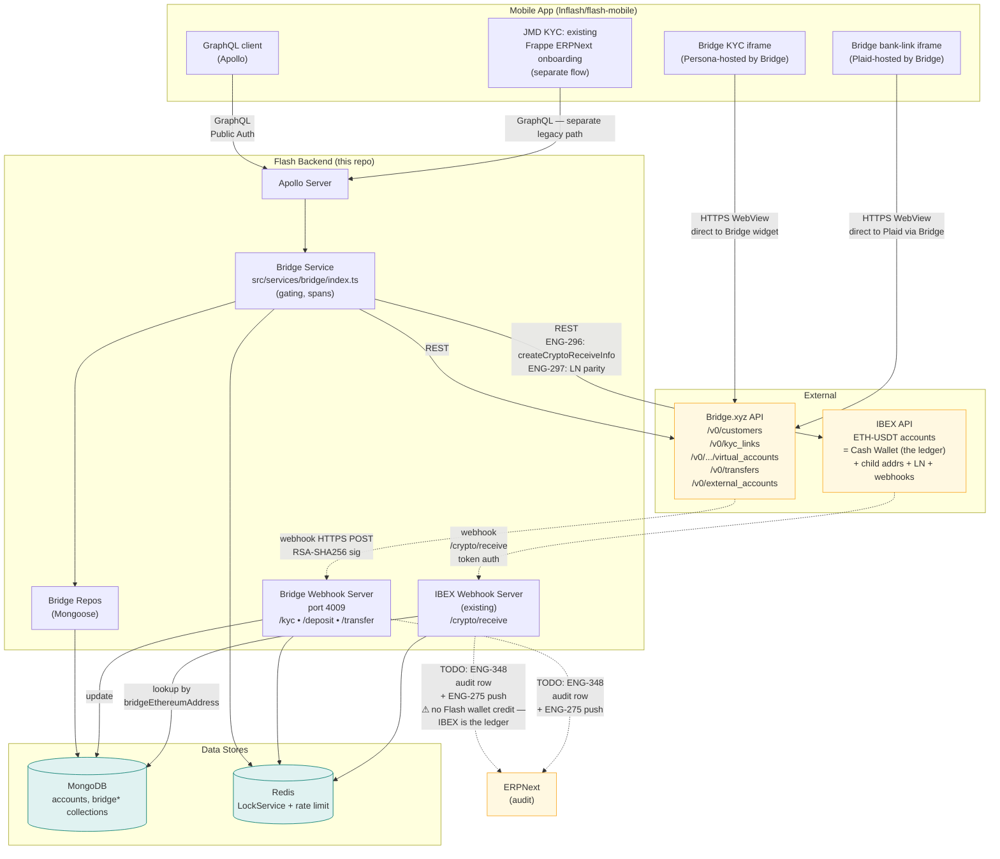
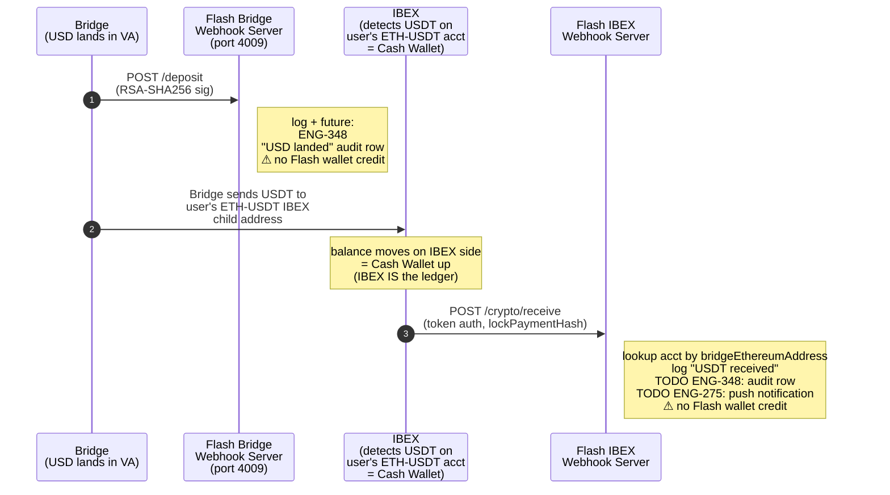

# Bridge Integration — Architecture

> **Status:** Specification, partially implemented. Code state aligned with `lnflash/flash:docs/bridge-integration-spec` @ `85af420` (= `heyolaniran/flash:bridge_integration` tip). The architecture described here matches what is built today **except** for `ENG-296` (IBEX Ethereum USDT address provisioning), which gates Virtual Account creation and the on-ramp's IBEX-credit step.
>
> **Audience:** Flash backend engineers, mobile-app engineers, ops/SRE, security reviewers.
>
> **Companion docs:** `FLOWS.md` (sequence-level behavior, state machines, edge cases), `API.md` (GraphQL surface), `WEBHOOKS.md` (request/response contracts), `SECURITY.md`, `OPERATIONS.md`, `LIMITS.md`.

---

## §1. Purpose & Scope

### What this document covers
- The component-level architecture of the Bridge.xyz USD on-/off-ramp integration inside Flash backend.
- The Ethereum (USDT-on-ETH) settlement layer, as actually wired in code (the original Tron design has been retired — see §13 history).
- Bridge.xyz REST API integration, IBEX `/crypto/receive` integration, Persona KYC integration via Bridge KYC Links.
- The standalone webhook-server process, its routes, signature verification, and idempotency model.
- Data model, configuration, security model, and observability hooks.

### What this document does **not** cover
- Step-by-step user-facing flows, state machines, or edge-case handling — see `FLOWS.md`.
- GraphQL field-level contracts — see `API.md`.
- Webhook request/response shapes and Bridge event taxonomy — see `WEBHOOKS.md`.
- The legacy JMD-domestic flow (Frappe-backed deposits) and Cashout V1 (RTGS withdrawals) — those have their own specs; this doc only references them where the Bridge stack interacts with the same mobile-app router or backend account.
- Mobile-app architecture beyond the withdrawal-routing surface area.

### Key non-goals (architectural decisions, not omissions)
- **No US PII on Flash systems.** All Bridge-jurisdiction (US-style) KYC PII is collected inside Bridge's hosted Persona experience, loaded directly from Bridge into a WebView/iframe in the mobile app. Flash stores only the Bridge-issued `customerId` and a coarse status. (This contrasts with the **existing JM KYC flow**, which still runs through Frappe ERPNext for legacy reasons; that flow is unchanged by this integration and is out of scope here. See §3 for how the two coexist on the mobile-app side.)
- **No on-chain accounting.** Flash never custodies USDT on Ethereum directly. IBEX manages a parent-account/child-address scheme; Flash stores only the per-account child address (`bridgeEthereumAddress`). **The IBEX ETH-USDT account IS the Flash Cash Wallet** — IBEX is the ledger. There is no parallel Flash-side USDT wallet ledger. Balance changes happen on IBEX's side as a function of inbound/outbound USDT; Flash never "credits" or "debits" a wallet of its own. The Flash-side work on the IBEX `crypto.received` webhook is (a) write an ERPNext audit row and (b) emit a push notification — not credit a ledger.
- **No off-ramp jurisdiction gating in Flash.** Bridge enforces rail eligibility at the External Account link step (its hosted Plaid/bank-link flow). Flash trusts the linked External Account.

---

## §2. System Overview

The integration enables Level-2+, **opted-in** Flash users to:
1. **On-ramp USD → USDT-on-ETH:** Receive USD via ACH/wire to a Bridge-issued Virtual Account; Bridge converts to USDT and sends to the user's IBEX-managed ETH-USDT child address; IBEX detects the deposit and notifies Flash via `/crypto/receive`. Because **the IBEX ETH-USDT account IS the user's Cash Wallet**, the balance moves on IBEX's side automatically — Flash does not "credit" a separate ledger; the Flash-side work is an ERPNext audit row and a push notification.
2. **Off-ramp USDT-on-ETH → fiat:** Read the user's IBEX ETH-USDT account balance; instruct IBEX to send USDT from the user's child address to Bridge's collection address on Ethereum (the balance debit happens on IBEX's side as the natural consequence of the send); Bridge converts to fiat and disburses on a supported rail (US ACH/FedWire, EUR SEPA, GBP FPS, MXN SPEI, BRL PIX, COP Bre-B, SWIFT post-May 15, 2026) to the user's linked **External Account**. ERPNext audit row written for this leg too.
3. **KYC (Bridge-jurisdiction)** is orchestrated via Bridge-issued KYC Links, rendered inside a WebView/iframe in the mobile app loaded **directly from Bridge** (the host name on the URL is Bridge's, not Flash's). Bridge runs the Persona session; Flash never sees the PII. The Bridge-side iframe-embedding configuration (e.g., the `/verify` → `/widget?...&iframe-origin=...` rewrite that Bridge documents for embedded use) is a **mobile-app + Bridge-dashboard concern**, not a backend feature; the backend simply returns Bridge's `kycLinkUrl` verbatim from `POST /v0/kyc_links` to the mobile app, which loads it.
4. **KYC (JMD)** continues to run through the existing Frappe ERPNext-backed onboarding flow — it does **not** use Bridge KYC Links and does not touch the Bridge service. The mobile app picks which KYC flow to surface based on the user's selected jurisdiction.

Jurisdiction support:
- **US:** available now (post-ENG-296).
- **JM:** available **post-May 15, 2026** day-one (Bridge added JM as supported with enhanced KYC).
- Other Bridge-supported countries are not yet enabled in Flash, even though Bridge would accept them — adding them is a config/feature-flag change, not an architectural one.

Routing of withdrawals between **Cashout V1** (existing JMD off-ramp via Flash backend + ERPNext + manual RTGS) and **Bridge off-ramp** is done by the mobile app; the backend exposes both as independent GraphQL mutations. See `FLOWS.md` §0 for the full routing matrix.

> **Cash Wallet migration model.** Phase 1 introduces a per-user opt-in
> swap from the legacy IBEX USD Cash Wallet to a new IBEX ETH-USDT
> Cash Wallet. Both wallets coexist on IBEX side forever; the Flash
> mobile UI shows only one Cash Wallet per user. Opt-in is permanent
> and non-reversible, and it is the gate for every Bridge feature in
> this doc set. Non-opted-in users keep the legacy USD Cash Wallet
> and never reach the surfaces described here. JM users opt in too —
> for them, Cashout V1's source wallet changes from legacy USD to
> ETH-USDT (handled by `ENG-357`).

---

## §3. Component Diagram



**Linear tickets surfaced in this diagram:**

| Ticket | Where it touches | Owner |
|---|---|---|
| [ENG-296](https://linear.app/island-bitcoin/issue/ENG-296) | Bridge Service → IBEX: `createCryptoReceiveInfo` for ETH-USDT account provisioning | Ben / Olaniran |
| [ENG-297](https://linear.app/island-bitcoin/issue/ENG-297) | IBEX: Lightning send/receive parity on the new ETH-USDT Cash Wallet | Olaniran |
| [ENG-273](https://linear.app/island-bitcoin/issue/ENG-273) | Bridge Webhook Server: monitoring + alerting | Nick |
| [ENG-275](https://linear.app/island-bitcoin/issue/ENG-275) | IBEX Webhook Server `/crypto/receive`: push notification | Laurent |
| [ENG-239](https://linear.app/island-bitcoin/issue/ENG-239) | Mobile: withdrawal router (Cashout V1 vs Bridge off-ramp) | Nick |
| **ENG-348** | Both webhook servers: ERPNext audit-row writer (IBEX is the ledger — this is audit, not bookkeeping) | **Ben** *(reassigned 15:52 ET; to be filed)* |
| **ENG-345/346 (opt-in)** | Bridge Service: per-user Cash Wallet opt-in toggle | Nick / Ben (to be filed) |
| **ENG-357** | Cross-project: ETH-USDT as first-class source wallet for Cashout V1 (ENG-296 is a cross-project blocker) | Olaniran + Ben (Bridge); Dread (Cashout V1 spec) (to be filed) |
| **ENG-347** | Flash-maintained country allowlist for UI entry | Dread / Nick (to be filed) |

**Diagram notes:**

- The Bridge KYC iframe and the Bridge bank-link iframe both load Bridge-hosted URLs **directly** from the mobile app. The Flash backend never proxies PII; it only requests the URLs from Bridge and hands them to the client.
- **The existing JMD KYC flow is a separate path** that runs through Frappe ERPNext via the legacy onboarding mutations. It is unchanged by the Bridge integration and is not depicted in the diagram. The mobile app decides which KYC flow to surface based on the user's selected jurisdiction at sign-up. A user can in principle hold both — JMD KYC (Frappe) for their JM identity and Bridge KYC (Persona) for US-style on/off-ramp — and the two state fields are independent.
- The **Bridge Webhook Server** is a separate Express process from the main Apollo Server (see §5), running on `BridgeConfig.webhook.port` (default 4009). It writes to MongoDB and Redis but does not import the Apollo schema.
- The **IBEX Webhook Server** is the existing IBEX webhook receiver inside Flash; the Bridge integration adds one new route handler at `POST /crypto/receive` that looks up an account by `bridgeEthereumAddress` (the on-ramp notification path). **Today this handler only logs the deposit.** The follow-on work is **not** "credit a Flash ledger" — IBEX is the ledger; the Cash Wallet balance has already moved on IBEX side by the time this webhook arrives. The follow-on work is **(a)** write an ERPNext audit row (`ENG-348`) and **(b)** emit a push notification to the user (`ENG-275`). Both are blocked on `ENG-296` so end-to-end is testable; see §5.4 and `WEBHOOKS.md` §4.2.
- The **Ethereum Network** does not appear as its own box — it is the substrate Bridge and IBEX both transact on. Flash never reads or writes chain state.
- The dashed split between `Bridge Webhook Server` and `IBEX Webhook Server` is significant: the Bridge `/deposit` webhook tells us "Bridge accepted fiat in the VA"; the IBEX `crypto.received` webhook tells us "USDT actually settled to the user's IBEX ETH-USDT account" (which IS the Cash Wallet). Neither webhook credits a Flash-side ledger — the balance lives on IBEX. The webhooks drive **audit + notification**, not bookkeeping. See §5.4.

---

## §4. Service Layer (`src/services/bridge/`)

### Module layout

```
src/services/bridge/
├── index.ts              # 645 lines — service methods, gating, repo orchestration
├── client.ts             # Thin REST client over Bridge.xyz HTTP API
├── config.ts             # Reads BridgeConfig: api key, webhook keys, port, feature flag
├── errors.ts             # BridgeError taxonomy
└── webhook-server/
    ├── index.ts          # Express bootstrap, port binding
    ├── middleware/
    │   └── verify-signature.ts   # RSA-SHA256 + 5-min skew + raw-body capture
    └── routes/
        ├── kyc.ts        # Updates Account.bridgeKycStatus
        ├── deposit.ts    # Log-only (intentional; IBEX does the credit)
        └── transfer.ts   # Updates BridgeWithdrawalRecord.status
```

### Method surface (in `src/services/bridge/index.ts`)

All eight methods are wrapped via `wrapAsyncFunctionsToRunInSpan({ namespace: "services.bridge" })` and gated by `checkBridgeEnabled()` + `checkAccountLevel(account, AccountLevel.Two)`.

| Method | Inputs | Outputs | Notes |
|---|---|---|---|
| `initiateKyc(accountId, type)` | account UUID, KYC type (`individual` / `business`) | `{ kycLinkUrl, expiresAt }` or `Error` | Real email pulled from Kratos identity (ENG-278). Re-link logic: if the customer already has a KYC link, refetch the latest; only mint a new link if status is `rejected` or `offboarded`. Persists `bridgeKycStatus: "not_started"` on first call. |
| `createVirtualAccount(accountId)` | account UUID | `{ virtualAccount }` or `Error` | **Currently returns `Error("IBEX Ethereum address creation not yet implemented")` — this is `ENG-296`.** All Bridge call params are already shaped for `payment_rail: "ethereum"`. Will read `account.bridgeEthereumAddress` once IBEX provisioning lands. |
| `addExternalAccount(accountId)` | account UUID | `{ linkUrl, expiresAt }` or `Error` | Returns a Bridge-hosted Plaid/bank-link URL the mobile app loads in an iframe; Bridge calls back via webhook on success. |
| `initiateWithdrawal(accountId, amount, externalAccountId)` | account UUID, amount string, EA UUID | `{ withdrawal }` or `Error` | Source rail = `ethereum`/`usdt` from `bridgeEthereumAddress`; destination = the EA's rail (e.g., `ach`/`usd`). **CRIT-1** balance check (ENG-280) and **CRIT-2** ownership + verified-status check (ENG-281) both implemented. |
| `getKycStatus(accountId)` | account UUID | `{ status }` | Standard repo read. |
| `getVirtualAccount(accountId)` | account UUID | record or `null` | Standard repo read. |
| `getExternalAccounts(accountId)` | account UUID | record array | Standard repo read. |
| `getWithdrawals(accountId)` | account UUID | record array | Standard repo read. |

### Gating contract (every method)

1. `checkBridgeEnabled()` reads `BridgeConfig.enabled` (a feature flag). If `false`, returns `BridgeFeatureDisabledError` — the service is "off" without code changes.
2. `checkAccountLevel(account, AccountLevel.Two)` — Bridge functionality is restricted to Level 2+ accounts. Below that, returns `InsufficientAccountLevelError`.

These checks happen **before** any Bridge API call, so a flag-flip or downgrade immediately blocks new operations (in-flight webhooks are still processed — see `FLOWS.md` §6).

### Span tracing

`wrapAsyncFunctionsToRunInSpan({ namespace: "services.bridge" })` produces spans named `services.bridge.<method>`. Each span captures the account UUID and (for write methods) the Bridge resource ID returned by the call. This is the primary observability surface (see §11).

---

## §5. Webhook Server

### Process model

`webhook-server/index.ts` boots a **standalone Express app** in the same Node.js process as the main Apollo Server but listens on a **separate port** (`BridgeConfig.webhook.port`, default `4009`). It does not share routing with Apollo and does not import the GraphQL schema. It does share the same MongoDB and Redis connections via the `mongoose` and `LockService` singletons.

> **Deployment implication:** any reverse proxy / ingress in front of Flash must route `POST /kyc`, `POST /deposit`, `POST /transfer` (under whatever public hostname is registered with Bridge) to port 4009 with the **raw request body** preserved. See §9.

### Routes

| Path | Handler | Purpose |
|---|---|---|
| `POST /kyc` | `routes/kyc.ts` | Persist `Account.bridgeKycStatus` transitions (`approved` / `rejected` / `offboarded` / `under_review`). |
| `POST /deposit` | `routes/deposit.ts` | **Log-only.** Bridge fires this when fiat lands in a Virtual Account; the actual wallet credit happens on the *IBEX* `crypto.received` webhook (§5.4). |
| `POST /transfer` | `routes/transfer.ts` | Update `BridgeWithdrawalRecord.status` (`processing` / `completed` / `failed` / `refunded`). |

> **Note:** the documented paths are exactly `/kyc`, `/deposit`, `/transfer` at the server root — **not** `/bridge/webhooks/{kyc,deposit,transfer}` as some earlier draft docs suggested. The current `WEBHOOKS.md` will be corrected in a follow-up sweep.

### Signature verification middleware

`middleware/verify-signature.ts` runs before every route handler and:

1. **Captures the raw request body** (Express's default JSON parser would discard it; the middleware uses a body-buffer approach so the bytes used for signature verification are exactly what Bridge signed).
2. Reads two headers from Bridge's POST: a **timestamp** (Unix-epoch seconds) and an **Ed-style signature** (RSA-SHA256-base64).
3. **Rejects requests outside the configured timestamp skew window** (`bridge.webhook.timestampSkewMs`, typically 5 minutes / `300_000` ms) — prevents replay of an old captured webhook.
4. Loads the **per-endpoint public key** from `BridgeConfig.webhook.publicKeys.{kyc|deposit|transfer}`. Bridge issues a separate signing key per event family; the middleware picks the right one by route.
5. Verifies the signature over `${timestamp}.${rawBody}`. On failure → `401`. On success → `next()` with a parsed JSON body attached to `req.body`.

### Idempotency

Each Bridge route handler wraps its work in `LockService().lockIdempotencyKey(lockKey)`. The lock key shape **differs per route**:

| Route | Lock key |
|---|---|
| `/kyc` | `bridge-kyc:${customer_id}:${event}` (event included so `approved` and a later `rejected` for the same customer don't collide) |
| `/deposit` | `bridge-deposit:${transfer_id}` (event **not** included; any retry of any deposit-family event for the same Bridge transfer collapses) |
| `/transfer` | `bridge-transfer:${transfer_id}` (event **not** included; same rationale as deposit) |

The IBEX `/crypto/receive` handler uses a different lock primitive: `LockService().lockPaymentHash(tx_hash, asyncFn)` (callback-style). The on-chain `tx_hash` is the lock key.

Locks are held in Redis and TTL'd; a duplicate webhook delivery (Bridge or IBEX retries on timeout/5xx) finds the key and the handler returns `200 { "status": "already_processed" }`. The handlers are also idempotent at the DB layer (status updates are last-write-wins); the lock primarily prevents concurrent execution.

See `WEBHOOKS.md` §2.4 and §4.3 for the full per-handler details.

### The two-webhook deposit notification model

This is the single most important architectural decision in the integration. **Important framing correction:** neither webhook "credits a Flash wallet." The IBEX ETH-USDT account IS the Cash Wallet, so the balance change happens on IBEX's side as a function of USDT actually arriving. The two webhooks drive **audit + user notification**, not bookkeeping.



**Linear tickets on this flow (not yet filed = to-be-filed):**

| Ticket | Where | Owner |
|---|---|---|
| [ENG-273](https://linear.app/island-bitcoin/issue/ENG-273) | Monitoring + alerts for both webhook legs | Nick |
| [ENG-275](https://linear.app/island-bitcoin/issue/ENG-275) | Push on `/crypto/receive` completion | Laurent |
| [ENG-276](https://linear.app/island-bitcoin/issue/ENG-276) | Reconciliation worker flags 24h Bridge-without-IBEX gap as orphan | Nick |
| **ENG-348** | Audit-row writer on both legs (replaces the old "wallet credit" framing) | **Ben** *(reassigned 15:52 ET; to be filed)* |

Why two webhooks? Bridge's deposit-family event tells us **fiat** landed in the VA — useful for ops visibility ("Bridge accepted; we're waiting on USDT settlement"). The IBEX `/crypto/receive` event tells us **USDT actually arrived** in the user's ETH-USDT IBEX account — i.e., the Cash Wallet balance is now up. Both events are needed for accurate audit (the spread between them is "in flight" for ops/finance). Neither writes a wallet ledger entry on Flash side, because there is no Flash-side wallet ledger to write to — that was the wrong mental model in earlier drafts.

The Bridge `/deposit` handler is intentionally minimal: it logs the event for reconciliation visibility (so ops can see "Bridge says fiat landed; we're waiting on IBEX") and will write an ERPNext audit row once `ENG-348` lands.

### IBEX `/crypto/receive` route (existing IBEX webhook server)

- **Path:** `POST /crypto/receive` — note: forward slash, not hyphen.
- **File:** `src/services/ibex/webhook-server/routes/crypto-receive.ts`.
- **Auth:** token-based (`authenticate` middleware) — **not** Bridge's RSA-SHA256 scheme. Same auth pattern as the rest of the IBEX webhook surface.
- **Required payload:** `{ tx_hash, address, amount, currency: "USDT", network: "ethereum" }`. The handler strictly enforces `currency === "USDT"` and `network === "ethereum"`.

Behavior today:
1. Validate the payload.
2. Acquire `LockService().lockPaymentHash(tx_hash, asyncFn)`.
3. Look up `Account` by `bridgeEthereumAddress` (404 if not found — orphan deposit, see `FLOWS.md` §6 manual reconciliation).
4. List the account's wallets and find the USDT wallet.
5. Convert `amount` to a `USDTAmount`.
6. **Log `info` "USDT deposit received"** with `accountId`, `walletId`, `amount`, `tx_hash`, `address`.
7. Return `200 { "status": "success" }`.

**Not yet implemented (held until ENG-296 lands so end-to-end is testable):**
- ERPNext audit-row write (`ENG-348`).
- Push notification (`ENG-275`).

There is **no** "wallet ledger credit" item in this list because IBEX's ETH-USDT account IS the Cash Wallet — the balance has already moved on IBEX's side by the time this webhook fires. Earlier draft docs (and the in-source `// TODO` comments) framed the missing work as "credit USDT wallet"; that wording is wrong and has been replaced with the audit + push framing above.

See `WEBHOOKS.md` §4 for the full handler spec, response codes, and the alert conditions ops should wire up.

---

## §6. Data Model

### MongoDB collections (`src/services/mongoose/bridge-accounts.ts`)

| Collection | Purpose | Key fields | Indexes |
|---|---|---|---|
| `bridgeVirtualAccounts` | One row per (account, virtual account) | `accountId`, `bridgeVirtualAccountId`, `paymentRail`, `currency`, `depositInstructions`, `createdAt` | `(accountId)` unique |
| `bridgeExternalAccounts` | User's linked banks (off-ramp destinations) | `accountId`, `bridgeExternalAccountId`, `paymentRail`, `currency`, `bankName`, `last4`, `verifiedStatus`, `createdAt` | `(accountId, bridgeExternalAccountId)` compound unique — **enforces ownership at DB level** (CRIT-2 / ENG-281) |
| `bridgeWithdrawals` | One row per off-ramp transfer attempt | `accountId`, `bridgeTransferId`, `bridgeExternalAccountId`, `amount`, `currency`, `status`, `createdAt`, `updatedAt` | `(accountId, createdAt)` for history queries; `(bridgeTransferId)` unique for webhook lookups |

The `(accountId, bridgeExternalAccountId)` compound index is the key defense against a horizontal-privilege attack: even if a caller forges another user's `bridgeExternalAccountId` in `bridgeInitiateWithdrawal`, the DB lookup keyed on both fields returns nothing and the call fails closed.

### Account schema additions (`src/services/mongoose/schema/account.ts` and `src/domain/accounts/`)

| Field | Type | Sparse index? | Purpose |
|---|---|---|---|
| `bridgeCustomerId` | `string \| null` | yes (unique sparse) | Bridge's customer ID; lookup pivot for re-KYC and webhook handling |
| `bridgeKycStatus` | `enum: not_started \| under_review \| approved \| rejected \| offboarded \| null` | no | Coarse KYC state mirrored from Bridge webhooks |
| `bridgeEthereumAddress` | `string \| null` | yes (unique sparse) | IBEX-issued child address for this account; lookup pivot for the IBEX `/crypto/receive` webhook |

Repo methods on `AccountsRepository`: `updateBridgeFields(accountId, partial)`, `findByBridgeCustomerId(customerId)`, `findByBridgeEthereumAddress(address)`.

### What is *not* stored
- Full PII (name, address, DOB, SSN, etc.) for US-style KYC — lives in Bridge/Persona only.
- Bank account numbers, routing numbers — Bridge stores these; Flash stores only Bridge's opaque `bridgeExternalAccountId` plus a display `bankName` and `last4`.
- Private keys, seed phrases — Flash never holds custody.

---

## §7. External Integrations

### Bridge.xyz REST API

Client: `src/services/bridge/client.ts`. Configured via `BridgeConfig.apiKey` and `BridgeConfig.baseUrl` (sandbox vs production).

| Operation | Endpoint | Notes |
|---|---|---|
| `createCustomer` | `POST /v0/customers` | Idempotency-Key header used. |
| `getCustomer` | `GET /v0/customers/{id}` | |
| `createKycLink` | `POST /v0/kyc_links` | **Top-level endpoint, not nested under customer** — Bridge API quirk. Returns a `kycLinkUrl` which the backend hands to the mobile app verbatim; the app loads it in a WebView/iframe. Any iframe-embed URL transformation Bridge documents (e.g., `/verify` → `/widget?...&iframe-origin=...`) is applied **client-side or via Bridge dashboard config**, not by the backend. |
| `getLatestKycLink` | `GET /v0/customers/{id}/kyc_links?limit=1&order=desc` | Used by the re-link logic. |
| `createVirtualAccount` | `POST /v0/customers/{id}/virtual_accounts` | Body uses `payment_rail: "ethereum"`, `currency: "usdt"`. |
| `getExternalAccountLinkUrl` | `POST /v0/customers/{id}/external_accounts/plaid_link_url` | Returns a Bridge-hosted URL the mobile app embeds. |
| `listExternalAccounts` | `GET /v0/customers/{id}/external_accounts` | |
| `createTransfer` | `POST /v0/transfers` | **Top-level endpoint with `on_behalf_of: customer_id` in body — not nested under customer.** Source `payment_rail: "ethereum"`, `currency: "usdt"`; destination as per the EA. |
| `getTransfer` | `GET /v0/transfers/{id}` | |

All write operations send an `Idempotency-Key` header; the key is constructed deterministically per logical operation so retries during transient failure produce the same Bridge resource.

### IBEX

Three integration surfaces:
1. **ETH-USDT account / address provisioning (ENG-296, not yet built):** the future code will call `Ibex.createCryptoReceiveInfo({ accountId, network: "ethereum", currency: "usdt" })` and persist the returned child address into `account.bridgeEthereumAddress`. The provisioned IBEX ETH-USDT account **is** the user's new Cash Wallet — not just a "deposit address." Until this lands, `createVirtualAccount` returns an error and there is nothing to opt users into.
2. **Lightning send/receive on the ETH-USDT account (ENG-297, Phase-1 launch blocker):** IBEX's ETH-USDT accounts support Lightning per `docs.ibexmercado.com/reference/welcome`. Phase 1 must wire the Flash mobile app to use IBEX's LN endpoints against the new Cash Wallet so opted-in users do not lose existing LN capability.
3. **IBEX `/crypto/receive` webhook (existing pipeline, new route):** when IBEX detects an inbound USDT-on-ETH transfer to a child address, it POSTs to `/crypto/receive` on the Flash IBEX webhook server. The new route handler looks up the account by `bridgeEthereumAddress` and logs the deposit. **There is no Flash-side wallet credit step** — IBEX is the ledger; the balance has already moved on IBEX's side. The Flash-side follow-on work is the ERPNext audit row (`ENG-348`) and the push notification (`ENG-275`), held until ENG-296 lands. See `WEBHOOKS.md` §4 for full details.

### Persona (via Bridge KYC Links)

Persona is the actual KYC vendor; Bridge wraps it. Flash never integrates with Persona directly. The interaction surface is exactly:
1. Flash backend calls `POST /v0/kyc_links` on Bridge → receives `kycLinkUrl`.
2. Backend returns `kycLinkUrl` verbatim to the mobile app via the `bridgeInitiateKyc` GraphQL mutation.
3. Mobile app loads the URL in an in-app WebView/iframe (any embed-mode URL transformation per Bridge's docs is applied client-side and/or controlled by Bridge dashboard config).
4. User completes the Persona session inside Bridge's hosted experience.
5. Bridge's `kyc_link.*` webhook arrives at the Flash Bridge Webhook Server `/kyc` route.

This indirection is what keeps US-style PII off Flash systems.

---

## §8. Routing & Jurisdiction

This section is a brief architectural reference; **`FLOWS.md` §0 is the source of truth** for the routing matrix and jurisdiction rules.

The Flash backend exposes three independent withdrawal-style mutations (and their accompanying queries):
- **Cashout V1** mutation (JMD off-ramp, IBEX-pay + ERPNext + manual RTGS) — see [Cashout V1 Linear project](https://linear.app/island-bitcoin/project/cashout-v1-c1fbf09713bb).
- **`bridgeInitiateWithdrawal`** (Bridge off-ramp, USDT-on-ETH → fiat on Bridge-supported rail).
- The legacy in-app crypto-send path (out of scope for the Bridge integration).

The mobile app's withdrawal router (Cashout V1 / ENG-239 on `lnflash/flash-mobile`) decides which one to call based on the destination the user picks. Both paths invoke the Flash backend; neither bypasses it. The Bridge service layer is invoked **only** from the `bridgeInitiateWithdrawal` mutation; Cashout V1 calls are routed through the existing IBEX/ERPNext code path with no Bridge involvement.

---

## §9. Configuration & Deployment

### YAML configuration

Bridge configuration lives in the Flash backend's YAML config (the same `galoy.yaml`-style file used by the rest of the service), under the top-level `bridge:` key. Loaded by `src/config/yaml.ts` as `export const BridgeConfig = yamlConfig.bridge`. The schema (in `src/config/schema.ts`) requires:

```yaml
bridge:
  enabled: true                         # boolean — master feature flag (checkBridgeEnabled())
  apiKey: "<bridge-api-key>"            # string — Bridge.xyz REST API auth
  baseUrl: "https://api.bridge.xyz/v0"  # string — prod URL or sandbox URL
  webhook:
    port: 4009                          # integer — standalone webhook-server listen port
    timestampSkewMs: 300000             # integer — ±N ms allowed timestamp drift (signature middleware)
    publicKeys:
      kyc: "<RSA public key, PEM>"      # string — for /kyc signature verification
      deposit: "<RSA public key, PEM>"  # string — for /deposit
      transfer: "<RSA public key, PEM>" # string — for /transfer
```

Required fields (per schema): `enabled`, `apiKey`, `baseUrl`, `webhook` (and within webhook: `port`, `publicKeys`, `timestampSkewMs`; within publicKeys: `kyc`, `deposit`, `transfer`).

There is **no env-var-style override**; secrets must be injected into the YAML file at deploy time (Helm/secret-mount/etc.). The Bridge integration does **not** use `BRIDGE_*` environment variables.

> **Iframe origin / WebView config:** there is no backend-side configuration for this. The KYC and bank-link iframes are loaded directly from Bridge by the mobile app; any embed-mode URL transformation is a mobile-app and/or Bridge-dashboard concern.

### Deployment topology

- **Single Node.js process** runs both the Apollo Server (existing port) and the Bridge Webhook Server (port 4009).
- **Reverse proxy / ingress** must route the public webhook hostname's `POST /kyc`, `/deposit`, `/transfer` to port 4009 with raw body preserved (no body-rewrite middleware).
- **Outbound egress** from the Flash process must reach `api.bridge.xyz` and the IBEX API host.
- **MongoDB and Redis** are shared with the rest of the Flash backend — no new clusters needed.

### Bridge dashboard configuration (one-time)

For each environment (sandbox, production):
1. Register the public webhook URLs (`https://<flash-host>/kyc`, `/deposit`, `/transfer`) in the Bridge dashboard.
2. Capture the per-endpoint signing public keys Bridge displays; paste them into `bridge.webhook.publicKeys.{kyc,deposit,transfer}` in the YAML config.
3. Whitelist Flash's outbound IP if Bridge requires it for API access.
4. Configure the iframe-allowed origin (Flash mobile app's WebView origin) in the Bridge dashboard so KYC/bank-link iframes render correctly.

---

## §10. Security Model

### Authentication & authorization
- **GraphQL operations** use `GraphQLPublicContextAuth`; the resolver receives a verified user identity and resolves `accountId` from it. Callers cannot pass `accountId` directly.
- **Account level gate:** every Bridge service method calls `checkAccountLevel(account, AccountLevel.Two)` before any Bridge API call.
- **Feature flag gate:** every Bridge service method calls `checkBridgeEnabled()`.

### Webhook authenticity
- RSA-SHA256 signatures over `${timestamp}.${rawBody}`.
- **Per-endpoint public keys** — compromise of one key does not let an attacker forge another event family.
- **±5-minute timestamp skew** rejects replays.
- Raw-body capture ensures the bytes verified are exactly the bytes signed.

### Idempotency & race protection
- **Outbound:** every Bridge write call sends a deterministic `Idempotency-Key` header.
- **Inbound:** every Bridge webhook handler runs inside `LockService().lockIdempotencyKey()` keyed by `bridge-kyc:${customer_id}:${event}` (KYC includes event), `bridge-deposit:${transfer_id}` (deposit, no event), or `bridge-transfer:${transfer_id}` (transfer, no event). The IBEX `/crypto/receive` handler uses `LockService().lockPaymentHash(tx_hash, asyncFn)` instead. Full details in `WEBHOOKS.md` §2.4 and §4.3.

### Withdrawal authorization (the two CRIT items)
- **CRIT-1 (ENG-280) — balance check:** before calling Bridge's `createTransfer`, the service reads the user's USDT wallet balance and rejects if it cannot cover `amount` plus fees. Prevents over-spend.
- **CRIT-2 (ENG-281) — ownership + verified-status check:** the service queries `bridgeExternalAccounts` with the compound `(accountId, bridgeExternalAccountId)` index. If no row, it returns `BridgeExternalAccountNotFoundForAccountError`. It then checks `verifiedStatus === "verified"`; if not, returns `BridgeExternalAccountNotVerifiedError`. Prevents both horizontal-privilege attacks and sending to unverified destinations.

### PII boundary
- **No US-style PII on Flash systems.** Persona collection happens inside Bridge's iframe; Bridge stores. Flash holds `bridgeCustomerId` + `bridgeKycStatus` only.
- The existing JM flow's PII in Frappe ERPNext is unchanged by this integration — out of scope.

### Custody boundary
- Flash never holds Ethereum private keys. IBEX manages the parent-account / child-address scheme; Flash stores only the public child address.

### Threat model items deferred to `SECURITY.md`
- Webhook public-key rotation procedure
- Bridge API key rotation
- Compromise-recovery runbook
- Rate-limit and abuse-protection design (links to `ENG-285`, `ENG-286`)

---

## §11. Observability

### Tracing
- All eight service methods produce spans under `services.bridge.<method>` via `wrapAsyncFunctionsToRunInSpan`.
- Span attributes include `accountId`, the Bridge resource ID returned (`customerId`, `virtualAccountId`, `transferId`, etc.), and result classification (`ok` / `error_<code>`).

### Logging
- Webhook handlers log the full event ID (`event.id`) on entry and exit, plus the lock-acquired/released boundary, so Bridge's idempotency behavior is visible in logs.
- Service methods log gating outcomes (flag-disabled, level-too-low) at `info` level so ops can see "rejected before reaching Bridge."

### Metrics (to be added — `ENG-273`)
- Counter: webhook deliveries by route + outcome (`accepted` / `signature_failed` / `lock_skipped` / `handler_failed`).
- Counter: service-method outcomes by method + result.
- Histogram: Bridge API call latency by operation.
- Gauge: open `BridgeWithdrawalRecord.status === "processing"` count (stuck-transfer alarm).

### Alerts (to be defined — `ENG-273`, `OPERATIONS.md`)
- Webhook signature-failure rate > X / min (key compromise or misconfig).
- IBEX `crypto.received` not received within 24h of Bridge `deposit.received` (orphan deposit / manual-reconciliation needed).
- Bridge API 5xx rate > threshold (circuit-breaker trigger — `ENG-286`).

---

## §12. Open Work

| Linear | Description | Severity | Notes |
|---|---|---|---|
| **ENG-296** | IBEX ETH-USDT account / address provisioning (`Ibex.createCryptoReceiveInfo` for ETH). The provisioned IBEX account IS the new Cash Wallet. | **Critical** | Without provisioning, `bridgeCreateVirtualAccount` returns an error, there is no new Cash Wallet to opt users into, and the on-ramp is end-to-end broken. |
| **ENG-297** | Lightning send/receive parity on the IBEX ETH-USDT Cash Wallet | **Critical (Phase-1 launch blocker)** | Opted-in users must keep existing LN capability. IBEX docs confirm support; Flash surface must wire it. |
| **ENG-345/346 (opt-in)** | Per-user Cash Wallet opt-in toggle (settings screen, permanent, non-reversible, gates Bridge features) | **Critical** | No way to switch a user from legacy IBEX USD wallet to the new ETH-USDT Cash Wallet. |
| **ENG-348** | ERPNext audit-row writer for every Bridge ↔ IBEX USDT movement under a Flash user | High | Finance/accounting requirement; replaces the old "wallet ledger credit" framing for the `/crypto/receive` handler and adds the off-ramp leg too. |
| **ENG-357** | Cashout V1 source-wallet switch for opted-in JM users (source = ETH-USDT, not legacy USD) | High | Opted-in JM users would otherwise lose Cashout V1 access. |
| **ENG-347** | Flash-maintained country allowlist (superset of Bridge + Caribbean markets) gating UI entry | Med | Without it, UI entry depends on Bridge's list, which excludes Caribbean markets where Cashout V1 must surface. |
| **ENG-275** | `/crypto/receive` push notification (formerly listed as "wallet credit + push") | Med | Owner: Laurent. The "wallet credit" half is removed (IBEX is the ledger); the push half remains. |
| ENG-282/283/284 | Open security items | High | Owner: Laurent. Details in their respective tickets. |
| ENG-285 | Withdrawal amount validation (min/max, dust) | Med | Owner: Nick. |
| ENG-286 | Bridge API circuit breaker | Med | Owner: Nick. |
| ENG-273 | Webhook monitoring / alerting | Med | Owner: Nick. Drives §11 metrics + alerts. |
| ENG-274 | Sandbox E2E test suite | Med | Owner: Nick. |
| ENG-276 | Reconciliation worker (Bridge ↔ IBEX ↔ Mongo cross-check) | Med | Owner: Nick. Backstop for orphan deposits and stuck transfers. |
| ENG-272 | Ops runbook | Med | Owner: Nick. Becomes `OPERATIONS.md`. |
| ENG-239 | Mobile-app Cashout API integration (Cashout V1, drives the withdrawal router) | Med | Owner: Nick. Cross-stack: backend mutations exist; mobile UX needs the router that picks between Cashout V1 and `bridgeInitiateWithdrawal`. |

### Architectural items not yet ticketed
- Webhook public-key rotation procedure (operational, but architectural insofar as it constrains how the keys are loaded — currently a process restart is required to re-read env vars).
- Reconciliation worker's data model (likely a new `bridgeReconciliationRuns` collection).
- A configuration story for adding new Bridge-supported countries beyond US/JM (likely just expanding an allow-list in `BridgeConfig`).

---

## §13. Document History

| Date | Change | Author |
|---|---|---|
| 2026-04-21 | Full rewrite: ETH-only, four-service architecture (service / client / webhook-server / repos), redrawn component diagram, two-webhook deposit model documented, data model + indexes + Account additions tabulated, security model expanded with CRIT-1/CRIT-2, observability section added, open-work table aligned with current Linear state. | Taddesse + Dread |
| 2026-04-21 | Revisions: added explicit JMD-KYC catch in §2/§3 (Frappe-backed, separate from Bridge KYC); §5 timestamp skew sourced from `bridge.webhook.timestampSkewMs`; §7 + §9 corrected — backend does not perform `/verify` → `/widget` URL rewrite (mobile/dashboard concern); §9 replaced fictional `BRIDGE_*` env-var table with the actual `bridge:` YAML config schema. | Taddesse + Dread |
| 2026-04-21 | Code-grounded corrections after pulling actual webhook handlers: IBEX route is `POST /crypto/receive` (slash, not hyphen); the handler currently only logs — wallet credit + push are not yet implemented and are folded into the ENG-296 dependency. §3 component diagram updated. §5.3 idempotency lock-key shapes corrected (KYC includes event; deposit/transfer use only `transfer_id`; IBEX uses `lockPaymentHash`). §5.4 two-webhook diagram and IBEX route description rewritten to match real behavior. §6, §7, §10, §12 updated for consistency. | Taddesse + Dread |
| 2026-04-22 | **Architectural correction (Dread, 13:09 ET):** IBEX ETH-USDT account IS the Cash Wallet — no Flash-side wallet ledger; webhooks drive audit + push, not bookkeeping. §1 key-non-goals, §2 system overview, §3 diagram notes, §5.4 two-webhook diagram + narrative, §7 IBEX integration, §12 open-work all rewritten. New tickets surfaced: ENG-345/346 (opt-in), ENG-348, ENG-357, ENG-347. ENG-297 promoted to Phase-1 launch blocker. Per-user permanent opt-in migration model added in §2/§5.4. | Taddesse + Dread |
| 2026-04-22 14:29 ET | **Diagram modernization (Dread).** Replaced the §3 ASCII component diagram with a Mermaid `flowchart` (subgraphs for Mobile App / Flash Backend / Data Stores / External, with interactive `click` directives to Linear issues on every significant node: ENG-296, ENG-297, ENG-273, ENG-275, + NEW-* project-URL placeholders) and added a "Linear tickets surfaced in this diagram" reference table. Replaced the §5.4 two-webhook ASCII diagram with a Mermaid `sequenceDiagram` including participant `link` directives and a companion ticket table. Owner + ticket ID appear in node labels so the cross-references survive renderers that strip `click`. | Taddesse + Dread |
| 2026-04-22 15:52 ET | **ENG-348 reassigned to Ben (Dread).** Per Dread: the ERPNext audit-row writer belongs on Ben rather than Olaniran (or Dread as relief). Rationale: the audit writer sits on top of the `/crypto/receive` + `/deposit` + `/transfer` webhook paths Ben now owns after the 15:36 ET IBEX handoff (moved into LINEAR-PROPOSAL.md during the prior cascade but not yet reflected here) — consolidating the audit writer with the handlers that emit the USDT-movement events avoids cross-engineer handoffs at the ticket boundary. Changes in ARCHITECTURE.md: §3 component-diagram ticket table (ENG-348 owner: `Olaniran or Dread` → `Ben *(reassigned 15:52 ET; to be filed)*`); §5.4 two-webhook ticket table (ENG-348 owner: `Olaniran / Dread` → `Ben *(reassigned 15:52 ET; to be filed)*`). Dread remains the ERPNext contract counterpart. §12 open-work priority row (ENG-348 priority High — owner not listed there, so unchanged). Diagram owner labels and `click` directives unchanged — they reference ENG-348 as a generic ticket link, not an owner tag. | Taddesse + Dread |
| 2026-04-22 14:52 ET | **Parse-error fix (Dread).** §3 component diagram line 33 had an unquoted `(` inside a flowchart pipe-edge label (`\|GraphQL<br/>(separate legacy path)\|`) which Mermaid's parser rejected as a `PS` token. Replaced the parens with `&mdash; separate legacy path` (rewrote as `\|GraphQL &mdash; separate legacy path\|`). Grep-verified no other pipe-edge labels in the file carry unquoted parens. | Taddesse + Dread |
| (prior) | Original 67-line draft, Tron-based, missing webhook server / Mongo / Redis / iframe-KYC / two-webhook split. | heyolaniran et al. |
