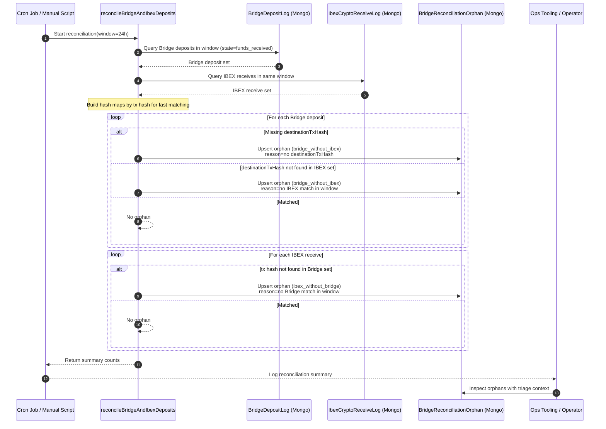

# ENG-276 Implementation Resume

## Context

`ENG-276` targets operational reliability for Bridge on-ramp deposits by closing the gap between:

- Bridge transfer/deposit lifecycle events
- IBEX crypto receive settlement events
- Operator tooling needed to replay and triage failures

The issue also folds in two related reliability needs:

- Persist Bridge fee on every deposit log row
- Provide replay capability for stuck webhook handlers

In practice, Flash receives information from two systems that represent different parts of the same real-world flow:

1. Bridge emits webhook events for transfer state transitions.
2. IBEX emits crypto receive webhooks when USDT settlement is observed.

Without reconciliation and replay tooling, operations cannot quickly identify:

- Bridge events that never materialized in IBEX
- IBEX settlements with no corresponding Bridge event
- Stuck handlers needing replay

---

## What We Are Solving

### Primary objective (ENG-276 acceptance scope)

1. Orphan events must be surfaced with triage context (ops visibility).
2. Replay CLI must rerun stuck handlers for a chosen transfer id.
3. Bridge fee value must be persisted on every deposit row.

### Supporting objective

Ensure replay handling matches Bridge webhook envelope format documented by Bridge:

- `event_type` can be generic (`updated.status_transitioned`)
- `event_object_status` carries status transitions like `funds_received`
- `event_object` carries the resource payload
- `event_created_at` carries event timestamp

Reference:
- [Bridge webhook event structure](https://apidocs.bridge.xyz/platform/additional-information/webhooks/structure)
- [Bridge list webhook events](https://apidocs.bridge.xyz/api-reference/webhooks/list-webhook-events)

---

## How It Was Solved

## 1) AC3: Fee persisted on every deposit row

### Changes

- Deposit handler now always computes `developerFee` with fallback chain:
  1. `receipt.developer_fee`
  2. `event_object.developer_fee`
  3. `"0"`
- `developerFee` made required/defaulted in persistence path.

### Result

Every `BridgeDepositLog` row has a fee value, including null/missing upstream fee cases.

---

## 2) AC1: Orphan detection and ops surfacing

### Changes

- Added IBEX receive log persistence.
- Added reconciliation service comparing 24h Bridge deposits vs IBEX receives.
- Added orphan persistence model with rich triage context.
- Added reconciliation execution in cron and manual script entrypoint.

### Result

Ops can now see explicit orphan records with:

- orphan type (`bridge_without_ibex` / `ibex_without_bridge`)
- correlation keys (transfer id / tx hash)
- detection window
- reason and context required for triage

---

## 3) AC2: Replay by chosen transfer id

### Changes

- Replay CLI supports `--transfer-id`.
- Replay filtering extracts transfer id from supported object shapes.
- Replay route accepts canonical Bridge envelope and maps it to existing handlers.

### Result

Ops can target replay for a specific transfer id rather than replaying all events in a window.

---

## 4) Bridge documentation alignment fixes

### Event list API fix

Bridge webhook events listing uses:

- `GET /webhook_events`
- query params like `starting_after`, `limit`, `category`

Client was updated to use this endpoint and parameter mapping while preserving internal caller interface.

### GET idempotency fix

Bridge rejects `Idempotency-Key` on certain GET endpoints (including webhook events list).  
Client request logic now sends `Idempotency-Key` only on non-GET methods.

---

## Reconciliation Sequence Diagram (Step-by-Step)



---

## Manual Validation Summary

## Curl Samples (Manual Console Tests)

Set base variables:

```bash
BASE_URL="http://localhost:4009"
REPLAY_SECRET="also-not-so-secret"
```

AC3 Case A (receipt fee present; expected persisted `developerFee = "0.5"`):

```bash
curl -s -X POST "$BASE_URL/internal/replay" \
  -H "Content-Type: application/json" \
  -H "Authorization: Bearer $REPLAY_SECRET" \
  -d '{
    "event_id":"wh_ac3_a_101",
    "event_type":"updated.status_transitioned",
    "event_object_status":"funds_received",
    "event_object":{
      "id":"tr_ac3_a_101",
      "state":"funds_received",
      "amount":"10.00",
      "currency":"usd",
      "developer_fee":"0.2",
      "on_behalf_of":"cust_a",
      "receipt":{"developer_fee":"0.5","initial_amount":"10.00","subtotal_amount":"9.50","final_amount":"9.50","destination_tx_hash":"tx_ac3_a_101"}
    },
    "event_created_at":"2026-05-06T10:00:00.000Z",
    "operator":"manual-test",
    "time_window_start":"2026-05-06T00:00:00.000Z",
    "time_window_end":"2026-05-06T23:59:59.000Z",
    "dry_run":false
  }'
```

AC3 Case B (receipt fee null; fallback to `event_object.developer_fee`, expected `"0.7"`):

```bash
curl -s -X POST "$BASE_URL/internal/replay" \
  -H "Content-Type: application/json" \
  -H "Authorization: Bearer $REPLAY_SECRET" \
  -d '{
    "event_id":"wh_ac3_b_101",
    "event_type":"updated.status_transitioned",
    "event_object_status":"funds_received",
    "event_object":{
      "id":"tr_ac3_b_101",
      "state":"funds_received",
      "amount":"20.00",
      "currency":"usd",
      "developer_fee":"0.7",
      "on_behalf_of":"cust_b",
      "receipt":{"developer_fee":null,"initial_amount":"20.00","subtotal_amount":"19.30","final_amount":"19.30","destination_tx_hash":"tx_ac3_b_101"}
    },
    "event_created_at":"2026-05-06T10:05:00.000Z",
    "operator":"manual-test",
    "time_window_start":"2026-05-06T00:00:00.000Z",
    "time_window_end":"2026-05-06T23:59:59.000Z",
    "dry_run":false
  }'
```

AC3 Case C (both missing/null; expected default `"0"`):

```bash
curl -s -X POST "$BASE_URL/internal/replay" \
  -H "Content-Type: application/json" \
  -H "Authorization: Bearer $REPLAY_SECRET" \
  -d '{
    "event_id":"wh_ac3_c_101",
    "event_type":"updated.status_transitioned",
    "event_object_status":"funds_received",
    "event_object":{
      "id":"tr_ac3_c_101",
      "state":"funds_received",
      "amount":"30.00",
      "currency":"usd",
      "on_behalf_of":"cust_c",
      "receipt":{"developer_fee":null,"initial_amount":"30.00","subtotal_amount":"30.00","final_amount":"30.00","destination_tx_hash":"tx_ac3_c_101"}
    },
    "event_created_at":"2026-05-06T10:10:00.000Z",
    "operator":"manual-test",
    "time_window_start":"2026-05-06T00:00:00.000Z",
    "time_window_end":"2026-05-06T23:59:59.000Z",
    "dry_run":false
  }'
```

AC2 replay command (transfer-id targeted replay):

```bash
BRIDGE_WEBHOOK_REPLAY_SECRET="$REPLAY_SECRET" BRIDGE_WEBHOOK_URL="$BASE_URL" \
yarn replay-bridge-events --configPath dev/config/base-config.yaml \
  --start 2026-05-01T00:00:00Z --end 2026-05-07T00:00:00Z \
  --event-type transfer --transfer-id tr_ac3_b_101
```

AC1 reconciliation command:

```bash
. ./.env && yarn reconcile-bridge-ibex-deposits --configPath dev/config/base-config.yaml --window-hours 24
```

DB verification query (without `mongosh`, using node + mongoose):

```bash
. ./.env && node -e "const mongoose=require('mongoose'); (async()=>{await mongoose.connect(process.env.MONGODB_CON); const db=mongoose.connection.db; const deposit=await db.collection('bridgedepositlogs').find({transferId:{\$in:['tr_ac3_a_101','tr_ac3_b_101','tr_ac3_c_101']}},{projection:{_id:0,transferId:1,developerFee:1,destinationTxHash:1,createdAt:1}}).sort({createdAt:-1}).toArray(); const orphans=await db.collection('bridgereconciliationorphans').find({txHash:{\$in:['tx_ac3_a_101','tx_ac3_b_101','tx_ac3_c_101']}},{projection:{_id:0,orphanType:1,orphanKey:1,transferId:1,txHash:1,detectedAt:1}}).sort({detectedAt:-1}).toArray(); console.log(JSON.stringify({deposit, orphans}, null, 2)); await mongoose.disconnect(); })().catch(async(e)=>{console.error(e); try{await mongoose.disconnect();}catch{} process.exit(1);});"
```

### AC3 checks

Three manual replay cases confirmed persisted values:

- Case A: receipt fee present -> persisted that receipt fee
- Case B: receipt fee null -> persisted fallback `event_object.developer_fee`
- Case C: both missing/null -> persisted `"0"`

### AC1 checks

Reconciliation run produced orphan rows and summary counts, confirming surfacing path.

### AC2 checks

Replay command path works with transfer-id filter; endpoint-level issues were resolved by:

- switching to documented webhook events listing endpoint
- removing idempotency header on GET

---

## Final State

`ENG-276` goals are implemented with:

- deterministic fee persistence
- reconciliation + orphan triage surface
- replay targeting for specific transfers
- Bridge API/documentation-aligned event retrieval and envelope handling

