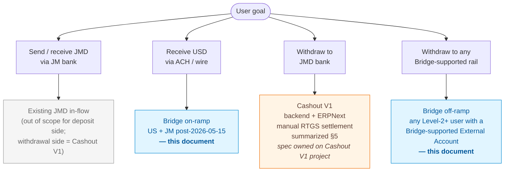
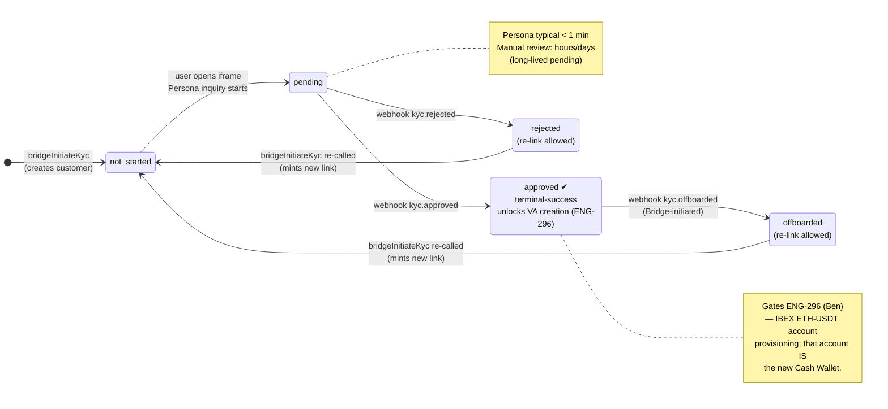
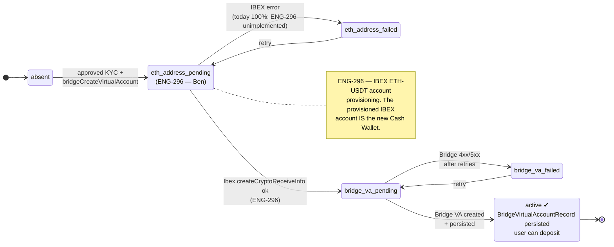
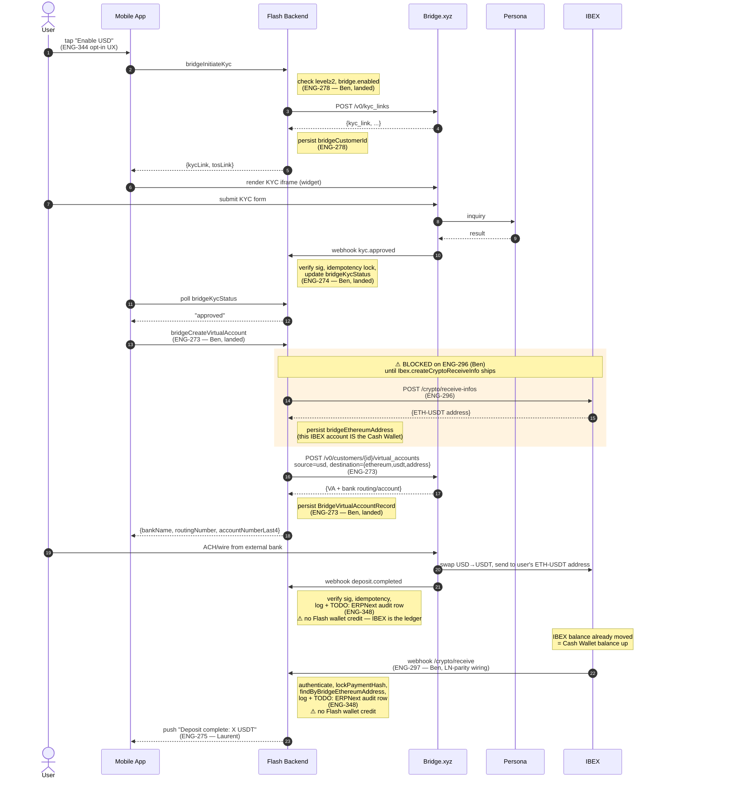
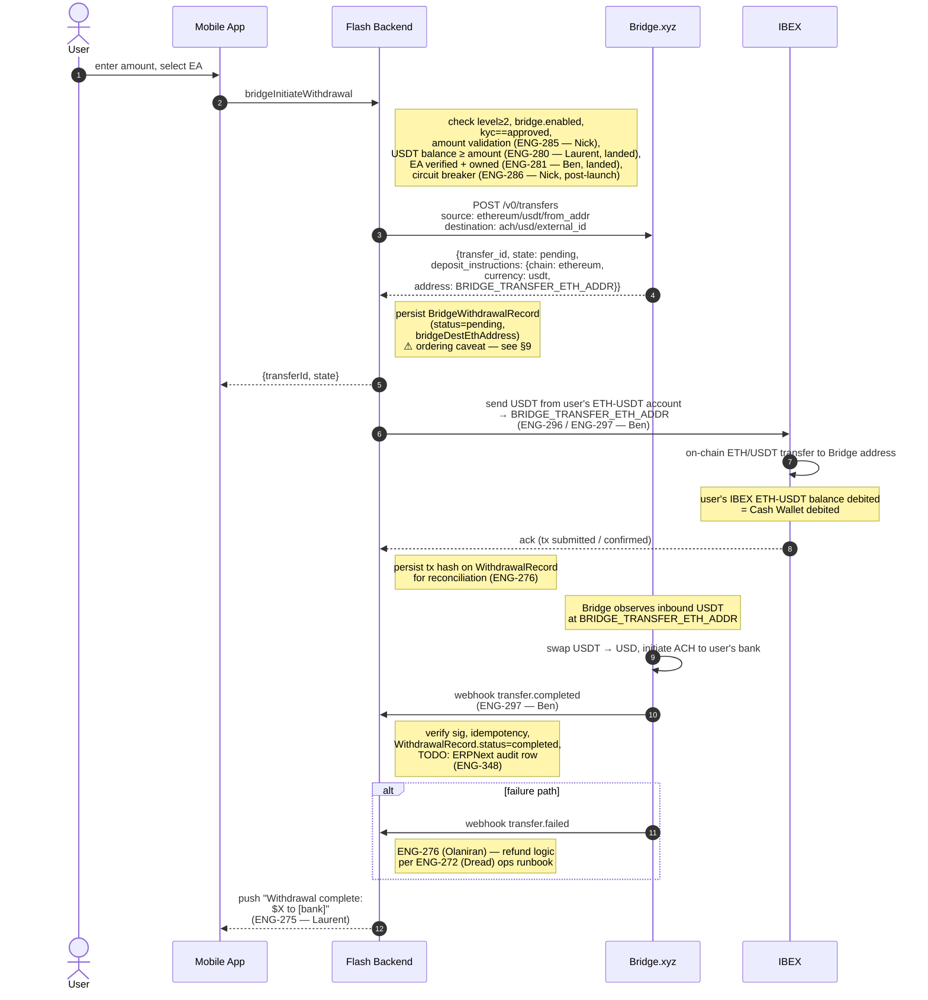
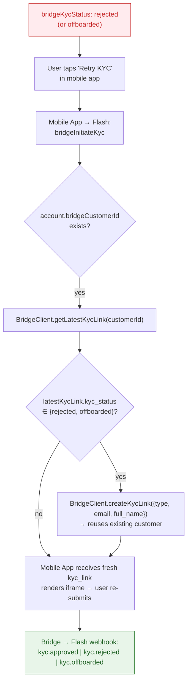

# Bridge Integration — Flows

> **Status:** Specification, not yet fully implemented. See §9 for open work and `ENG-296` for the gating dependency on IBEX Ethereum USDT address provisioning.
>
> **Audience:** Flash backend engineers, mobile-app engineers, ops/reconciliation engineers.
>
> **Companion docs:** `ARCHITECTURE.md`, `API.md`, `WEBHOOKS.md`, `SECURITY.md`, `OPERATIONS.md`, `LIMITS.md`.

---

## §0. Routing & Jurisdiction

> **Cash Wallet migration (new in Phase 1).** Every Bridge-touching flow below assumes the user has **opted in** to the new IBEX ETH-USDT Cash Wallet. Opt-in is a per-user, permanent, non-reversible toggle in the settings screen; non-opted-in users remain on the legacy IBEX USD Cash Wallet and never reach any of these flows. The opt-in flow itself is documented in §3e. **JM users are included** — post-opt-in, their Cash Wallet is the IBEX ETH-USDT account, which changes Cashout V1's source wallet (see §5 and `ENG-357`).

Three flows coexist; a user may use any combination depending on the bank accounts they have:



**Rules:**

1. **JMD-domestic flow** (existing, Frappe-backed, in/out via JM bank rails): out of scope for this document for the deposit side. The withdrawal side ("Cashout V1") is touched on in §5 because the mobile app's router has to choose between it and the Bridge off-ramp; the authoritative spec for Cashout V1 lives in the [Cashout V1 Linear project](https://linear.app/island-bitcoin/project/cashout-v1-c1fbf09713bb).
2. **Bridge on-ramp** (USD → USDT-on-ETH): available to **US and JM (post-May 15, 2026)** Level-2+ accounts.
3. **Bridge off-ramp** (USDT-on-ETH → fiat): available to **any** Level-2+ user whose linked **External Account** sits on a Bridge-supported rail (US ACH/FedWire, EUR SEPA, GBP FPS, MXN SPEI, BRL PIX, COP Bre-B, plus SWIFT post-May 15). Bridge enforces rail eligibility at link time; **Flash does not gate by country**.
4. **Mobile app withdrawal router.** Because a single user may have both a JMD bank on file (Cashout V1) and a Bridge External Account (e.g., a JM user who linked a US bank during Bridge onboarding), the mobile app surfaces a choice — "Withdraw to JMD Bank" vs "Withdraw to US Bank" — and routes to the appropriate backend mutation. **Both paths invoke the Flash backend**; they differ in which mutation is called and which downstream system orchestrates settlement (Cashout V1 → IBEX payment + ERPNext Cashout DocType + manual RTGS by support; Bridge off-ramp → IBEX USDT send → Bridge transfer → ACH/etc. to External Account). The backend exposes both flows as independent GraphQL mutations and trusts the app's routing.

Per-account jurisdiction is read from `Account.country` (set during Level-2 KYC). It is informational for analytics/limits — **not** a gating field for Bridge operations.

---

## §1. Scope & Glossary

### What this document covers
- Bridge.xyz USD on-ramp via ACH/wire to a Bridge **Virtual Account**, settling as **USDT on Ethereum** in an IBEX-managed receive address, credited to the user's USDT wallet.
- Bridge.xyz off-ramp via ACH from the user's USDT wallet to a linked US bank account (**External Account**).
- KYC orchestration via Bridge-issued KYC links, rendered in an embedded iframe inside the Flash mobile app.
- Webhook handling for KYC, deposit, transfer events from Bridge, and crypto-receive events from IBEX.

### What this document does NOT cover
- JMD domestic banking (existing flow; out of scope).
- BTC and Lightning operations (handled elsewhere in the codebase).
- Mobile-app UI specifics beyond the iframe contract (separate repo).
- Frappe ERPNext ledger migration (future work).

### Actors

| Actor | Role |
|---|---|
| **User** | End user with a Level-2+ Flash account in a supported jurisdiction (US or JM post-May 15). |
| **Mobile App** | Flash mobile app (separate repo). Renders the KYC iframe, calls Flash GraphQL, receives push notifications. |
| **Flash Backend** | This codebase. Service layer at `src/services/bridge/`, GraphQL at `src/graphql/public/`, webhook server at `src/services/bridge/webhook-server/`. |
| **Bridge.xyz** | USD on/off-ramp processor. Holds KYC, virtual accounts, external accounts, transfers. |
| **Persona** | KYC vendor used by Bridge. Renders inside the Bridge iframe; never touches Flash backend. |
| **IBEX** | Provides the user's **ETH-USDT account — which IS the Flash Cash Wallet after opt-in.** IBEX is the ledger; the balance lives on IBEX's side. IBEX provisions the account + child ETH address, observes deposits, and notifies Flash via `/crypto/receive`. Flash does not run a parallel USDT ledger. |

### Data-flow constraint (CRITICAL)

**No US KYC PII traverses or is stored on Flash infrastructure.** The Bridge KYC iframe submits all PII directly from the user's device to Persona/Bridge. Flash backend only ever sees:
- The KYC link URL (to forward to the mobile app)
- KYC status changes via webhook (`approved` / `rejected` / `offboarded`)
- A Bridge customer ID

> **Existing JM PII storage is unchanged.** The existing JMD banking flow already collects and stores Jamaican customer KYC + banking information in Flash's self-hosted Frappe ERPNext instance; that flow remains in scope for our existing data-protection posture (Jamaica's Data Protection Act 2020). The Bridge integration introduces **no new PII storage on Flash systems** for either US or JM users.

This constraint — keeping US PII off Flash systems — is what lets us add Bridge without expanding into US privacy-regime scope (CCPA and the patchwork of US state privacy laws) or pulling US KYC data into a SOC 2 audit perimeter. **Any future change that would route US PII through Flash backend or ERPNext requires explicit security and compliance review** — see `SECURITY.md`.

### Glossary

| Term | Definition |
|---|---|
| **KYC Link** | Bridge-issued URL pointing to a Persona-hosted KYC inquiry. Two flavors: `/verify` (full-page) and `/widget` (iframe-embeddable). Flash uses `/widget`. |
| **Virtual Account** (VA) | Bridge-issued bank routing + account number that the user funds via ACH/wire. Each VA has a destination crypto address; Bridge converts incoming USD to USDT and sends to that address. |
| **External Account** (EA) | A user's own bank account, linked via Bridge's hosted bank-linking flow (Plaid for US ACH). Used as a withdrawal destination. Has a `pending` → `verified` → `failed` lifecycle. |
| **Transfer** | A Bridge-initiated movement of value (USDT → USD ACH, in our off-ramp case). Created by `BridgeClient.createTransfer()`. |
| **Receive Info** | An IBEX-managed crypto receive address. Created via `POST /crypto/receive-infos`. We use one per user for ETH USDT. |

---

## §2. Pre-conditions Matrix

Every Bridge operation must clear **all** of its pre-conditions or return a typed error:

| Operation | `bridge.enabled` | `account.level` | `bridgeKycStatus` | `country` | Other |
|---|---|---|---|---|---|
| `bridgeInitiateKyc` | true | ≥ 2 | any | US or JM | Kratos identity has `email` |
| `bridgeKycStatus` (query) | true | ≥ 2 | any | any | — |
| `bridgeCreateVirtualAccount` | true | ≥ 2 | `approved` | US or JM | `bridgeCustomerId`, `bridgeEthereumAddress` (ENG-296) |
| `bridgeVirtualAccount` (query) | true | ≥ 2 | any | any | — |
| `bridgeAddExternalAccount` | true | ≥ 2 | `approved` | any (Bridge enforces rail eligibility) | `bridgeCustomerId` |
| `bridgeExternalAccounts` (query) | true | ≥ 2 | any | any | — |
| `bridgeInitiateWithdrawal` | true | ≥ 2 | `approved` | any | EA `verified` + owned by caller; USDT balance ≥ amount |
| `bridgeWithdrawals` (query) | true | ≥ 2 | any | any | — |
| Deposit (passive, webhook-driven) | true | — | `approved` | US or JM | VA exists, ETH address registered |

**Error mapping:**
- Feature flag off → `BridgeDisabledError`
- Level too low → `BridgeAccountLevelError`
- KYC not approved → `BridgeKycPendingError` / `BridgeKycRejectedError`
- No customer → `BridgeCustomerNotFoundError`
- Balance shortfall → `BridgeInsufficientFundsError`
- EA ownership / status mismatch → `Error("External account not found")` (deliberately vague — do not leak existence)

---

## §3. State Machines

> **ELI5 — what is a state machine?**
>
> Think of a state machine as a **board game** for one piece of data (a customer, a virtual account, a deposit, a withdrawal). The board has a small number of **squares** (states) — for example a KYC application can be `not_started`, `pending`, `approved`, `rejected`, or `offboarded`. The piece sits on one square at a time and can only move to **certain other squares** along **labeled arrows** (transitions) — e.g. "the `kyc.approved` webhook fires" moves the piece from `pending` → `approved`. Some arrows go nowhere (`approved` is a dead-end "you won" square called a *terminal-success state*). Some squares have a one-way exit only (you can leave `rejected` only by re-starting KYC).
>
> Why do we use them? Three reasons:
> 1. **They make illegal moves visible.** If our code ever tries to move a piece in a way the diagram doesn't allow (e.g. `not_started` → `approved` without going through `pending`), that is a bug — and an auditable one.
> 2. **They make the system testable.** Each transition is one test case ("when this webhook fires from this state, the piece must end up on that square").
> 3. **They survive race conditions.** Two webhooks arriving in the wrong order should still produce a valid state — and the diagram tells you exactly what's valid.
>
> Each subsection below (3a–3e) is one such "board" for one kind of object. Read each one as: *circles = states, arrows = the events that move the object between states, double-edged squares = terminal/end states*. Owner + Linear ticket are embedded in each state label so you can see who is building each piece of the transition logic.

### 3a. KYC state machine



**Transitions:**

| From | To | Trigger | Side effects |
|---|---|---|---|
| `null` | `not_started` | `bridgeInitiateKyc` mutation, customer created via `BridgeClient.createKycLink` | Persist `bridgeCustomerId`, `bridgeKycStatus = "not_started"` |
| `not_started` | `pending` | User opens iframe and starts the Persona inquiry (no Flash-side state change; status read from Bridge on next poll) | — |
| `pending` | `approved` | Bridge webhook `kyc.approved` | `bridgeKycStatus = "approved"`. Unlocks VA creation. |
| `pending` | `rejected` | Bridge webhook `kyc.rejected` | `bridgeKycStatus = "rejected"`. User can call `initiateKyc` again to mint a fresh link. |
| `approved` | `offboarded` | Bridge webhook (Bridge-initiated offboarding) | `bridgeKycStatus = "offboarded"`. Blocks further ops; user can re-link. |
| `rejected` / `offboarded` | `not_started` | `bridgeInitiateKyc` re-called; service detects non-success status and creates new KYC link (see `index.ts:152-167`) | New `kyc_link` issued |

**Implementation notes:**
- The service's `initiateKyc` is **idempotent on the customer**: if `bridgeCustomerId` already exists, it does NOT create a new customer; it asks Bridge for the latest KYC link via `getLatestKycLink`.
- A new KYC link is only minted when the latest one is `rejected` or `offboarded`.
- Persona's typical decision time is < 1 minute for both US and JM (post-May 15) submissions; design UX accordingly. Manual review (rare) may extend to hours/days — handle as a long-lived `pending` state, not a separate state.

### 3b. VirtualAccount state machine

Per-account; one VA per user.



| State | Meaning | Code touch-point |
|---|---|---|
| `absent` | User has approved KYC but no VA yet. | Pre-mutation state. |
| `eth_address_pending` | Calling IBEX to provision ETH USDT receive address. | `Ibex.createCryptoReceiveInfo` (ENG-296). |
| `eth_address_failed` | IBEX call failed. | Currently returns `Error("IBEX Ethereum address creation not yet implemented")`. |
| `bridge_va_pending` | ETH address known; calling Bridge to create the VA. | `BridgeClient.createVirtualAccount`. |
| `bridge_va_failed` | Bridge call failed (4xx/5xx after retries). | Surface error; do NOT persist a half-baked VA record. |
| `active` | VA persisted; user can deposit. | Row exists in `BridgeVirtualAccountRecord`. |

**Implementation notes:**
- Today, `eth_address_pending → eth_address_failed` happens 100% of the time because ENG-296 is unimplemented. The on-ramp is end-to-end blocked until ENG-296 lands.
- VA creation should be transactional from the user's perspective: ETH address provisioning + Bridge VA creation + DB persistence either all succeed or all roll back. If Bridge VA creation fails after IBEX has minted an address, the address should be retained on `Account.bridgeEthereumAddress` so a retry doesn't leak addresses.

### 3c. Deposit state machine (per event)

A user may deposit many times into the same VA; each deposit traverses this machine independently. **Two systems must agree** for a deposit to terminate successfully — Bridge confirms the fiat side, IBEX confirms the crypto side.

```mermaid
stateDiagram-v2
    direction TB
    [*] --> awaiting_funds
    awaiting_funds --> bridge_received: Bridge sees ACH/wire<br/>land in VA
    bridge_received --> bridge_converting: Bridge swaps<br/>USD → USDT
    bridge_converting --> bridge_sent_onchain: Bridge deposit.completed<br/>webhook (tx_hash known)
    bridge_sent_onchain --> ibex_received: IBEX crypto.received webhook<br/>(balance moved on IBEX side =<br/>Cash Wallet up)
    bridge_sent_onchain --> orphaned: no IBEX event<br/>within 24h SLA
    orphaned --> manual_reconciliation: ops opens ticket
    bridge_received --> bridge_returned: Bridge bounces<br/>(wrong amount / sender /<br/>KYC expired)

    ibex_received: ibex_received ✔ TERMINAL<br/>Flash → ERPNext audit row<br/>(ENG-348)<br/>+ push (ENG-275 — Laurent)
    bridge_returned: bridge_returned ✗ TERMINAL<br/>no USDT minted; no IBEX side
    orphaned: orphaned<br/>(ENG-276 reconciler flags)
    manual_reconciliation: manual_reconciliation<br/>(ENG-272 runbook)

    note right of ibex_received
        Neither webhook credits a Flash wallet.
        IBEX ETH-USDT account IS the Cash
        Wallet; balance moves on IBEX side.
        Flash-side work = audit + push only.
    end note
```



| State | Owner | Persisted? | Notes |
|---|---|---|---|
| `awaiting_funds` | implicit | No | Default state; we don't persist until Bridge fires. |
| `bridge_received` | Bridge | No (we don't currently get a webhook for this intermediate state) | Could be added if Bridge exposes it. |
| `bridge_converting` | Bridge | No | Same. |
| `bridge_sent_onchain` | Flash | Yes — log entry from Bridge `deposit.completed` webhook (idempotent via `bridge-deposit:{tx_hash}` lock) | No Flash wallet credit — there is no Flash-side wallet ledger. |
| `ibex_received` | IBEX (Flash logs) | Yes — IBEX `/crypto/receive` webhook fires (idempotent via `lockPaymentHash(tx_hash)`); Flash writes ERPNext audit row (`ENG-348`) and sends push (`ENG-275`). **IBEX's ETH-USDT account balance — the Cash Wallet — has moved on IBEX's side.** | Terminal: success. |
| `orphaned` | Flash (reconciler) | Yes — flagged after 24h | Driven by ENG-276 reconciliation worker (TODO). |
| `manual_reconciliation` | Ops | Yes | Ops runbook in `OPERATIONS.md` (ENG-272). |
| `bridge_returned` | Bridge | Yes — webhook event TBD; today not handled | Need to extend Bridge webhook handler. |

**Why two webhooks?** Bridge owns the fiat-rail confirmation; IBEX owns the chain-receipt confirmation. Both events are needed for accurate audit — the gap between them is "in flight" for finance/ops. **Neither webhook "credits a Flash wallet"** — the Cash Wallet balance lives on IBEX (the IBEX ETH-USDT account IS the Cash Wallet). The webhooks drive **audit + push**, not bookkeeping.

**Idempotency keys:**
- Bridge deposit log: `bridge-deposit:{tx_hash}` via `LockService`
- IBEX `/crypto/receive`: `lockPaymentHash(tx_hash)` (callback-style)

### 3d. Cash Wallet opt-in state machine (new)

Per user; one-shot, permanent, non-reversible. This is the gate to every Bridge-touching flow below.

```mermaid
stateDiagram-v2
    direction TB
    [*] --> legacy_usd
    legacy_usd --> opt_in_pending: user taps<br/>"Switch to USDT Cash Wallet"<br/>+ confirms permanence dialog
    opt_in_pending --> eth_usdt_ready: Ibex.createCryptoReceiveInfo ok<br/>(ENG-296)
    opt_in_pending --> opt_in_failed: IBEX error
    opt_in_failed --> opt_in_pending: user retries
    eth_usdt_ready --> eth_usdt_active: flip account.cashWallet<br/>= "eth_usdt"<br/>(permanent)
    eth_usdt_active --> [*]

    legacy_usd: legacy_usd (default)<br/>legacy IBEX USD Cash Wallet<br/>no Bridge features
    opt_in_pending: opt_in_pending<br/>(ENG-345/346 (opt-in) — Nick/Ben)
    eth_usdt_ready: eth_usdt_ready<br/>(ENG-296 provisioned;<br/>about to flip pointer)
    eth_usdt_active: eth_usdt_active ✔ TERMINAL<br/>one-way, non-reversible<br/>Bridge features unlock

    note right of eth_usdt_active
        Downgrade is NOT self-serve.
        Support-ops ticket only.
        See OPERATIONS.md §3 opt-in rollout.
    end note
    note left of opt_in_pending
        Gated on:
          • ENG-296 (Ben) account prov
          • ENG-297 (Ben) LN parity —
            opting in without LN = regression
    end note
```



| State | Persisted? | Notes |
|---|---|---|
| `legacy_usd` | Implicit (default; `account.cashWallet` absent or `"legacy_usd"`) | User sees the legacy IBEX USD Cash Wallet; no Bridge features. |
| `opt_in_pending` | Yes — written when user confirms in settings | UI shows a one-time confirm dialog ("This is permanent"); blocks the button while pending. |
| `eth_usdt_ready` | Yes — written after successful `Ibex.createCryptoReceiveInfo` returns a child address | Account has `bridgeEthereumAddress`; about to flip the Cash Wallet pointer. |
| `eth_usdt_active` | Yes — `account.cashWallet = "eth_usdt"` | Terminal. User now sees the new Cash Wallet and all Bridge features unlock (subject to KYC, account level, etc.). **Non-reversible**: no mutation flips this back. |
| `opt_in_failed` | Yes — retryable | User stays on legacy; settings screen surfaces retry. |

**Implementation notes:**
- Ticket: **ENG-345/346 (opt-in)** (Nick/Ben). Depends on ENG-296 (account provisioning) and ENG-297 (LN parity — the new wallet must have LN send/receive on day one or opting in is a regression).
- The Flash UI must **only ever show one Cash Wallet** — never both. Both legacy IBEX USD and new IBEX ETH-USDT accounts exist on IBEX's side; Flash picks which one to surface based on `account.cashWallet`.
- ERPNext audit row on the opt-in event itself is TBD (probably wanted for compliance — flag for finance review).
- A downgrade path does **not** exist. If a user regrets the opt-in, that is a support-ops ticket, not a self-serve flow.

### 3e. Withdrawal state machine

Per withdrawal; persisted as `BridgeWithdrawalRecord`.

```mermaid
stateDiagram-v2
    direction TB

    [*] --> pending
    pending --> submitted : Bridge createTransfer ok<br/>bridgeTransferId received
    submitted --> processing : Bridge intermediate<br/>webhook (rare)
    submitted --> completed : transfer.completed
    processing --> completed : transfer.completed
    submitted --> failed : transfer.failed
    processing --> failed : transfer.failed
    failed --> refunded : manual ops
    completed --> [*]
    refunded --> [*]

    pending : pending<br/>persisted BEFORE Bridge call<br/>CRIT-1 ENG-280 balance +<br/>CRIT-2 ENG-281 owner (both landed)
    submitted : submitted<br/>bridgeTransferId received
    processing : processing<br/>(rarely emitted by Bridge)
    completed : completed ✔ TERMINAL<br/>push ENG-275 (Laurent) +<br/>audit ENG-348
    failed : failed ✗<br/>push notification fires;<br/>refund logic TBD
    refunded : refunded<br/>manual ops • ENG-276 (Olaniran)<br/>per ops runbook • ENG-272 (Dread)
```



| State | Set by | Notes |
|---|---|---|
| `pending` | `bridgeInitiateWithdrawal` mutation, immediately after balance/ownership/verified-status checks pass and **before** Bridge call | Allows recovery if Bridge call crashes after creating the transfer but before our DB write (see edge case below). |
| `submitted` | After successful `BridgeClient.createTransfer` | We have a `bridgeTransferId`. |
| `processing` | Optional intermediate from Bridge webhook (if Bridge exposes) | — |
| `completed` | Bridge webhook `transfer.completed` (idempotent via `bridge-transfer:{transfer_id}:completed`) | Push notification (ENG-275). |
| `failed` | Bridge webhook `transfer.failed` | Push notification; refund logic TBD. |
| `refunded` | Manual ops action | Per `OPERATIONS.md` runbook. |

**Persistence-ordering caveat (current code):** Today the service calls `BridgeClient.createTransfer` first, then writes the `BridgeWithdrawalRecord`. If the Bridge call succeeds and the DB write fails, the user has a Bridge transfer with no Flash record. Recommended fix: write `pending` row first, update to `submitted` after Bridge ack. Capture as a follow-up in §9.

---

## §4. On-ramp Sequence (USD → USDT-on-ETH)

Applies to **US and JM** Level-2+ users. JMD-only users do not enter this flow.



**Ticket map for this flow (§4 On-ramp):**

| Step | Mutation / Webhook / Call | Ticket | Owner | Status |
|---|---|---|---|---|
| entry UX | "Enable USD" button + opt-in decision tree | [ENG-344](https://linear.app/island-bitcoin/issue/ENG-344) | Nick | in flight |
| opt-in mutation | `bridgeEnableCashWallet` (mutation name TBD) | [ENG-345/346 (opt-in)](https://linear.app/island-bitcoin/project/bridge-wallet-integration-a1596c3a2b6a) | Nick/Ben | to be filed |
| KYC link | `bridgeInitiateKyc` → `POST /v0/kyc_links`, persist `bridgeCustomerId` | [ENG-278](https://linear.app/island-bitcoin/issue/ENG-278) | Ben | landed |
| KYC webhook | `kyc.approved` sig verify + idempotency + status update | [ENG-274](https://linear.app/island-bitcoin/issue/ENG-274) | Ben | landed |
| VA mutation | `bridgeCreateVirtualAccount` → `POST /v0/customers/{id}/virtual_accounts` | [ENG-273](https://linear.app/island-bitcoin/issue/ENG-273) | Ben | landed |
| IBEX ETH-USDT provisioning | `Ibex.createCryptoReceiveInfo` — **blocker** | [ENG-296](https://linear.app/island-bitcoin/issue/ENG-296) | **Ben** *(reassigned 15:36 ET)* | **in flight — launch blocker (cross-project: Bridge Integration + Cashout V1)** |
| Bridge deposit webhook | `transfer.completed` on VA deposit — sig + idempotency + audit | [ENG-297](https://linear.app/island-bitcoin/issue/ENG-297) | Ben | **launch blocker (LN parity)** |
| IBEX `/crypto/receive` webhook | authenticate + `lockPaymentHash` + `findByBridgeEthereumAddress` + audit | [ENG-297](https://linear.app/island-bitcoin/issue/ENG-297) | Ben | **launch blocker (LN parity)** |
| ERPNext audit row | write Journal Entry / ledger row on each webhook | [ENG-348](https://linear.app/island-bitcoin/project/bridge-wallet-integration-a1596c3a2b6a) | **Ben** *(reassigned 15:52 ET)* | **to be filed** |
| push notification | "Deposit complete: X USDT" | [ENG-275](https://linear.app/island-bitcoin/issue/ENG-275) | Laurent | in flight |
| mobile wallet UX | ETH-USDT balance/activity surfaces in app | [ENG-342](https://linear.app/island-bitcoin/issue/ENG-342) | Nick | in flight |

**Pre-launch gating dependency:** The IBEX `POST /crypto/receive-infos` call (ENG-296) is currently unimplemented; `createVirtualAccount` returns `Error("IBEX Ethereum address creation not yet implemented")`. Until ENG-296 lands, the on-ramp halts at the "persist `bridgeEthereumAddress`" step. **Also gated on ENG-345/346 (opt-in)** — this entire sequence is only reachable by users who have opted in to the IBEX ETH-USDT Cash Wallet. Non-opted-in users never see the "Enable USD" entry point.

> **Important framing (Dread 13:09 ET):** earlier versions of this diagram showed the Flash backend "crediting USDT wallet" on `/crypto/receive`. That step does not exist — the IBEX ETH-USDT account IS the Cash Wallet, and the balance has already moved on IBEX's side. The Flash-side work on `/crypto/receive` is (a) ERPNext audit row (`ENG-348`) and (b) push notification (`ENG-275`). The diagram above reflects the corrected model.

---

## §5. Off-ramp Sequence (USDT-on-ETH → fiat via Bridge-supported rail)

Available to **any** Level-2+ user with KYC approved who can link a bank account on a Bridge-supported rail (US ACH/FedWire, EUR SEPA, GBP FPS, MXN SPEI, BRL PIX, COP Bre-B, SWIFT post-May 15). The mobile app's withdrawal router (in development on `lnflash/flash-mobile`; tracked in [Cashout V1 / ENG-239](https://linear.app/island-bitcoin/issue/ENG-239)) decides between this Bridge flow and Cashout V1 (JMD off-ramp) based on which destination the user picks; the backend exposes both as independent mutations and trusts the app's choice. **Both flows invoke the backend** — the difference is which mutation runs and which settlement system (Bridge vs IBEX-pay-then-ERPNext+manual-RTGS) is engaged.

The example below uses the US ACH rail; other rails follow the same shape with different `payment_rail` and `currency` values on the destination side.

### 5.1 Linking an external bank account (one-time per bank)

```mermaid
sequenceDiagram
    autonumber
    actor U as User
    participant M as Mobile App
    participant F as Flash Backend
    participant B as Bridge.xyz
    participant PL as Plaid

    link M: ENG-342 Nick — mobile wallet UX (Add Bank surface) @ https://linear.app/island-bitcoin/issue/ENG-342
    link F: bridgeAddExternalAccount — already implemented in src/services/bridge/index.ts @ https://github.com/lnflash/flash/blob/master/src/services/bridge/index.ts
    link F: CRIT-2 ENG-281 ownership guard (landed) @ https://linear.app/island-bitcoin/issue/ENG-281
    link F: EA-VERIFIED-WEBHOOK (proposed; not yet filed) — pending→verified handler (to be filed) @ https://linear.app/island-bitcoin/project/bridge-wallet-integration-a1596c3a2b6a
    link B: Bridge.xyz External Account API @ https://apidocs.bridge.xyz/
    link PL: Plaid instant verify or micro-deposits @ https://plaid.com/

    U->>M: tap "Add bank"
    M->>F: bridgeAddExternalAccount<br/>(service method — already built)
    Note right of F: check level≥2, bridge.enabled,<br/>kyc==approved,<br/>ownership guard (ENG-281 landed)
    F->>B: POST /v0/customers/{id}/external_accounts/link
    B-->>F: {link_url, expires_at}
    F-->>M: {linkUrl, expiresAt}
    M->>B: open linkUrl in webview
    U->>PL: Plaid OAuth (or routing/account entry)
    PL-->>B: link confirmation
    Note over B: EA appears in listExternalAccounts<br/>status: pending → verified<br/>(Bridge micro-deposit OR Plaid instant verify)
    Note right of F: OPEN: does Bridge fire an<br/>external_account.verified webhook?<br/>Today = client re-fetches bridgeExternalAccounts.<br/>Tracked as EA-VERIFIED-WEBHOOK (proposed; not yet filed) in §9.
```

**Ticket map for this flow (§5.1 EA linking):**

| Step | Mutation / Route / Check | Ticket | Owner | Status |
|---|---|---|---|---|
| entry UX — "Add bank" | surface in mobile wallet | [ENG-342](https://linear.app/island-bitcoin/issue/ENG-342) | Nick | in flight |
| `bridgeAddExternalAccount` service method | wraps `POST /v0/customers/{id}/external_accounts/link`, returns Bridge-hosted link URL | **already implemented** — [`src/services/bridge/index.ts`](https://github.com/lnflash/flash/blob/master/src/services/bridge/index.ts) | Ben (original) | **landed (no ticket — pre-existing code)** |
| ownership guard on `bridgeExternalAccounts` query | prevent cross-account EA enumeration | [CRIT-2 / ENG-281](https://linear.app/island-bitcoin/issue/ENG-281) | Ben | landed |
| `pending → verified` webhook handler | no `external_account.verified` route exists today; client re-fetches `bridgeExternalAccounts` | [EA-VERIFIED-WEBHOOK (proposed; not yet filed)](https://linear.app/island-bitcoin/project/bridge-wallet-integration-a1596c3a2b6a) | Nick (suggested) | **to be filed** |
| Plaid/micro-deposit verification | out of scope for Flash (Bridge-hosted) | n/a | Bridge | external |

> **Direct answer to "what ticket is building `bridgeAddExternalAccount`?":** Nothing — the service method is already checked in at `src/services/bridge/index.ts`; it is not new work. The only adjacent Linear work is [ENG-281](https://linear.app/island-bitcoin/issue/ENG-281) (CRIT-2 ownership guard on the companion `bridgeExternalAccounts` list query, landed) and the un-filed **EA-VERIFIED-WEBHOOK (proposed; not yet filed)** item above.

**Open question (captured in §9):** Does Bridge fire a webhook when an EA transitions `pending → verified`, or do we need to poll `listExternalAccounts`? Today's code has no `external_account.verified` route; we currently rely on the user re-fetching `bridgeExternalAccounts`.

### 5.2 Initiating and settling a withdrawal



> **Direction-of-funds correction (Dread 2026-04-22 15:36 ET):** earlier drafts of this diagram showed Bridge "pulling USDT from the user's ETH address." That is **not** how the off-ramp works. Bridge does not pull. Bridge returns a destination ETH address (`deposit_instructions.address`) on `POST /v0/transfers`, and **the Flash backend then calls IBEX to send USDT from the user's IBEX ETH-USDT account to that Bridge-supplied address.** IBEX performs the actual on-chain ETH/USDT transfer; the user's Cash Wallet is debited the moment that transfer settles on IBEX. Bridge observes the inbound USDT, swaps to USD, and initiates the ACH/wire/SEPA/etc. payout. This is consistent with §4 on-ramp framing (IBEX is the ledger; movement happens on IBEX side).

**Ticket map for this flow (§5.2 withdrawal):**

| Step | Mutation / Route / Check | Ticket | Owner | Status |
|---|---|---|---|---|
| entry UX — withdrawal router | mobile app decides Bridge vs Cashout V1 | [ENG-239](https://linear.app/island-bitcoin/issue/ENG-239) | Nick | in flight |
| amount validation | min/max, precision, rail limits | [ENG-285](https://linear.app/island-bitcoin/issue/ENG-285) | Nick | in flight |
| CRIT-1 balance guard | pre-call balance ≥ amount check | [ENG-280](https://linear.app/island-bitcoin/issue/ENG-280) | Laurent | landed |
| CRIT-2 EA ownership guard | prevent cross-account EA use | [ENG-281](https://linear.app/island-bitcoin/issue/ENG-281) | Ben | landed |
| circuit breaker | rate-limit withdrawals on anomaly | [ENG-286](https://linear.app/island-bitcoin/issue/ENG-286) | Nick | **post-launch** |
| `bridgeInitiateWithdrawal` service | `POST /v0/transfers`, persist `BridgeWithdrawalRecord` (incl. `bridgeDestEthAddress` from `deposit_instructions`) | already implemented — [`src/services/bridge/index.ts`](https://github.com/lnflash/flash/blob/master/src/services/bridge/index.ts) | Ben (original) | **landed (pre-existing code; subject to ordering fix in §9)** |
| **Flash → IBEX outbound send** | call IBEX to send USDT from user's ETH-USDT account → `BRIDGE_TRANSFER_ETH_ADDR`, persist tx hash | [ENG-296](https://linear.app/island-bitcoin/issue/ENG-296) + [ENG-297](https://linear.app/island-bitcoin/issue/ENG-297) | **Ben** *(reassigned 15:36 ET from Olaniran)* | **launch blocker** |
| `transfer.completed` webhook | sig + idempotency + status update | [ENG-297](https://linear.app/island-bitcoin/issue/ENG-297) | **Ben** *(reassigned 15:36 ET)* | **launch blocker (LN parity)** |
| `transfer.failed` / refund handler | refund logic on failure | [ENG-276](https://linear.app/island-bitcoin/issue/ENG-276) | Olaniran | in flight |
| ops runbook for refund | manual procedure + admin UI | [ENG-272](https://linear.app/island-bitcoin/issue/ENG-272) | Dread | in flight |
| ERPNext audit row | write Journal Entry on completed/failed (incl. on-chain tx hash) | [ENG-348](https://linear.app/island-bitcoin/project/bridge-wallet-integration-a1596c3a2b6a) | **Ben** *(reassigned 15:52 ET)* | **to be filed** |
| push notification | "Withdrawal complete" / "Withdrawal failed" | [ENG-275](https://linear.app/island-bitcoin/issue/ENG-275) | **Ben (server) + Nick (client)** *(server half reassigned 15:36 ET)* | in flight |

**JM user with no Bridge External Account attempts off-ramp:** Mobile app's withdrawal router detects the user has no Bridge EA and calls the **Cashout V1** mutation instead of `bridgeInitiateWithdrawal`. Cashout V1 is itself backend-orchestrated: the backend collects the user's `BankAccount` (from `Account` / ERPNext Customer record), invokes IBEX to debit the user's Cash Wallet for the cashout amount + service fee, creates a `Cashout` DocType in ERPNext linked to the resulting JournalEntry and BankAccount, and then waits for a Flash support user to settle via RTGS through the admin UI. On RTGS settlement, a `PaymentEntry` is recorded in ERPNext and the user is notified via `adminPaymentEntryNotificationSend`. The Bridge service layer is never invoked in this branch, but the **backend and ERPNext are**. Authoritative spec: [Cashout V1 Linear project](https://linear.app/island-bitcoin/project/cashout-v1-c1fbf09713bb) (key tickets: ENG-199 Cashout DocType, ENG-197 PaymentEntry on RTGS, ENG-198 user notification, ENG-157 settlement admin page, ENG-239 mobile API integration, ENG-240 BankAccount query, ENG-292 BankAccount on offer).

> **Cashout V1 source-wallet change — ETH-USDT becomes first-class (Dread 2026-04-22 14:15 ET).** The IBEX debit in Cashout V1 historically pulls from the legacy IBEX USD account. On the Cashout V1 re-launch that aligns with this project, **ETH-USDT is the first-class source wallet** — Cashout V1's selection logic defaults to the opted-in user's IBEX ETH-USDT Cash Wallet, includes a USDT → USD swap via IBEX before the JMD off-ramp, and only falls back to the legacy IBEX USD account for users who have not yet opted in. This is tracked as **ENG-357** on this project (the Bridge-side half) and mirrored by a spec update on the Cashout V1 project itself (the opt-in decision tree + source-wallet selection — owned by Dread). **ENG-296 is now a cross-project launch blocker for both this project and Cashout V1.**

**JM user with linked US/EU/etc. External Account:** Mobile app surfaces a destination choice ("Withdraw to JMD Bank" vs "Withdraw to US Bank"). User picks; mobile app calls the matching mutation — either `bridgeInitiateWithdrawal` (this section) or the Cashout V1 mutation (above). Bridge off-ramp via the linked EA proceeds exactly as for a US user — Bridge has already verified rail eligibility at link time, so no Flash-side jurisdiction check is required.

---

## §6. Edge Cases

### 6.1 Deposit edge cases

| Scenario | Detection | Handling |
|---|---|---|
| Deposit below Bridge minimum | Bridge bounces; `transfer_returned`-style webhook | Notify user "Deposit below minimum, returned to sender" |
| Deposit above Bridge limit | Same | Same; encourage smaller deposit |
| Wrong sender (deposit from a third party) | Bridge bounces (KYC mismatch) | Notify user; explain sender-name match rule |
| Bridge KYC offboarded mid-deposit | Bridge holds funds; webhook `kyc.offboarded` | Block new operations; ops must reach out |
| IBEX ETH address provisioning fails | `createVirtualAccount` returns error | User retries; if persistent, escalate to ops |
| Bridge `deposit.completed` arrives, IBEX `crypto.received` never does | Reconciler (ENG-276): no IBEX event within 24h of Bridge event | State → `orphaned`; auto-page ops; runbook in `OPERATIONS.md` |
| Duplicate Bridge deposit webhook | `LockService` check on `bridge-deposit:{tx_hash}` | Return 200 `{status: "already_processed"}`; no double-log |
| Duplicate IBEX crypto-receive webhook | `LockService` check on `ibex-crypto-receive:{tx_hash}` | Return 200; no double-credit |
| User downgrades to Level < 2 mid-flow | Pre-condition check on next operation | Existing in-flight deposits complete; new ops blocked |
| `bridge.enabled=false` flipped while VA exists | Service-layer gate | New ops blocked; in-flight webhooks still processed (we keep accepting events even when feature is off, to avoid losing money) |

### 6.2 Withdrawal edge cases

| Scenario | Detection | Handling |
|---|---|---|
| Insufficient USDT balance | Pre-check before Bridge call | `BridgeInsufficientFundsError` |
| External account closed/invalid | `transfer.failed` webhook | Update record `status=failed`; notify user; suggest re-linking bank |
| Bridge API timeout | HTTP client timeout | Retry with backoff (TBD — ENG-286 circuit breaker); after N retries, return error to user; do NOT persist `pending` record on no-ack |
| IBEX fails to release USDT to Bridge | Bridge `transfer.failed` | Update record; refund flow TBD |
| Concurrent withdrawal from same account | DB write race | Today: not explicitly prevented. **Recommend:** advisory lock per `accountId` for the duration of `bridgeInitiateWithdrawal`. Capture as TODO. |
| EA ownership mismatch (user A tries to withdraw to user B's EA) | `findExternalAccountsByAccountId` + ID match; DB compound index `(accountId, bridgeExternalAccountId)` | Returns generic "External account not found" — **does not leak existence** (CRIT-2 / ENG-281) |
| EA not yet verified | Status check after ownership check | Returns "External account is not verified" |
| User attempts to link a bank on an unsupported rail (e.g., JMD domestic) | Bridge rejects at link time inside the hosted Plaid/bank-linking flow | User stays in the hosted flow until they pick a supported rail or back out; no Flash-side state mutation |
| JM user with no Bridge EA attempts withdrawal | Mobile-app withdrawal router | Routed to **Cashout V1** mutation (not `bridgeInitiateWithdrawal`); backend pays IBEX + writes ERPNext Cashout DocType; support settles RTGS manually. See Cashout V1 Linear project. |
| JM user with both JMD bank and Bridge EA | Mobile-app withdrawal router | User picks destination; mobile calls either `bridgeInitiateWithdrawal` (Bridge off-ramp, fully automated) or the Cashout V1 mutation (manual RTGS settlement). |
| Mid-flight feature flag flip | Pre-condition check at each step | New ops blocked; in-flight webhooks accepted |

### 6.3 KYC edge cases

| Scenario | Detection | Handling |
|---|---|---|
| Iframe fails to load (network, CSP, expired link) | Mobile-app side | Mobile app calls `bridgeInitiateKyc` again to mint a fresh link |
| KYC link expires before user submits | Same | Same |
| User abandons mid-inquiry | No webhook fires; status stays `not_started`/`pending` | Idempotent re-link via `bridgeInitiateKyc` |
| Bridge `kyc.rejected` | Webhook | `bridgeKycStatus = rejected`; user can retry via `bridgeInitiateKyc` (mints new link automatically) |
| Bridge `kyc.offboarded` | Webhook | Same as rejected, user can retry |
| Race: user calls `bridgeInitiateKyc` twice in parallel | Service is idempotent on `bridgeCustomerId` | First call creates customer; second call detects existing and reuses |
| KYC approved but VA creation later fails (ENG-296 unimplemented) | Service returns explicit error | User sees clear message; no Bridge state corruption |

### 6.4 Account / lifecycle edge cases

| Scenario | Detection | Handling |
|---|---|---|
| Account deletion request while VA exists | Account lifecycle hook | Block deletion until pending deposits/withdrawals settle; then offboard Bridge customer |
| Country change (rare; e.g., user moves US → JM after relocation) | Profile update | Future ops gated by new country; existing EA unusable for withdrawal once flagged |
| Two accounts attempt to claim the same Bridge customer ID (shouldn't happen) | Sparse unique index on `bridgeCustomerId` | Second insert errors |

---

## §7. Re-KYC Flow

When KYC ends in `rejected` or `offboarded`, the user can re-attempt without operator intervention.



**Code reference:** `src/services/bridge/index.ts:152-167`. The current implementation reuses the **same** `bridgeCustomerId` across re-attempts, which matches Bridge's expected pattern: a customer with a rejected inquiry can have a new inquiry attached to the same customer record.

**Limit (TODO):** No rate-limit on re-attempts in current code. Recommend a soft Flash-side limit (e.g., 3 re-attempts per 24h) to avoid abuse and to give users time to gather missing documents. Capture in §9.

---

## §8. Limits & Quotas

Detailed limits live in `LIMITS.md` (to be written). Summary:

| Dimension | Notes |
|---|---|
| **Per-deposit minimum/maximum** | Set by Bridge; differs by currency and rail. Currently not surfaced to users in app. |
| **Daily / monthly aggregates** | Set by Bridge; may differ by jurisdiction (US vs JM). Need to confirm via Bridge dashboard. |
| **Per-withdrawal minimum/maximum** | Set by Bridge + Flash policy. ENG-285 will add formal Flash-side validation. |
| **KYC tier limits** | Bridge tiers map roughly to PII collected; Flash currently uses Persona's default tier. |
| **High-risk jurisdiction multiplier** | JM = High risk; may have lower limits than US. Confirm via Bridge dashboard during May 15 rollout. |

UX recommendation: surface limits to the user in the deposit/withdrawal screens before they commit, rather than surfacing a Bridge rejection after the fact.

---

## §9. Open Items

### Gating for launch

| Ticket | Item | Owner | Why it gates launch |
|---|---|---|---|
| ENG-296 | IBEX ETH-USDT account / address provisioning (`Ibex.createCryptoReceiveInfo` for ETH). Provisioned account IS the new Cash Wallet. | **Ben** *(reassigned 15:36 ET)* | Without this, there is no new Cash Wallet to opt into; `bridgeCreateVirtualAccount` returns an error; the on-ramp is end-to-end broken. |
| **ENG-297** | **Lightning send/receive parity on the ETH-USDT Cash Wallet** (IBEX supports it per docs; Flash surface must match legacy-wallet LN capability) | **Ben** *(reassigned 15:36 ET)* | Without this, opted-in users lose LN — a regression. Phase-1 launch blocker (not post-launch). |
| **ENG-345/346 (opt-in)** | Per-user opt-in toggle (settings screen; permanent; gates Bridge features; Flash UI shows one Cash Wallet) | Nick/Ben | No way to switch users to the new Cash Wallet without this. Depends on ENG-296 + ENG-297. |
| **ENG-348** | ERPNext audit-row writer for every Bridge ↔ IBEX USDT movement (on-ramp deposit, off-ramp transfer) | **Ben** *(reassigned 15:52 ET)* | Finance/accounting requirement; replaces the old "wallet credit" framing on `/crypto/receive`. Consolidated with the `/crypto/receive` + `/deposit` + `/transfer` webhook handlers Ben now owns (per 15:36 ET) to keep the audit writer adjacent to the events it records. |
| **ENG-357** | Cashout V1: ETH-USDT as the first-class source wallet (default), legacy USD as fallback for non-opted-in users only. Includes USDT→USD swap via IBEX before JMD off-ramp. Mirrors a Cashout V1 project spec update (opt-in decision tree) owned by Dread. | Olaniran + Ben (Bridge side); Dread (Cashout V1 spec side) | Without this, Cashout V1 cannot launch with ETH-USDT as a first-class wallet. **ENG-296 blocks both this project and Cashout V1** (Dread 2026-04-22 14:15 ET). |
| **ENG-347** | Flash-maintained country allowlist (superset of Bridge + Caribbean markets) gating UI entry | Dread / Nick | UI entry today depends on Bridge's list, which excludes Caribbean markets where we want Cashout V1 to surface. |
| ENG-239 (mobile) | Cashout API integration on `lnflash/flash-mobile` — finalize the withdrawal router so it detects whether the user has a JMD bank, a Bridge EA, or both, and calls the matching backend mutation (Cashout V1 vs `bridgeInitiateWithdrawal`); surface destination choice when both exist | nick@getflash.io | Without this, users with both account types have no way to pick which rail to use. Backend already exposes both flows as independent mutations. Tracks alongside the Cashout V1 backend tickets (ENG-199, ENG-197, ENG-198, ENG-240, ENG-292, ENG-157). |

### Should-have for launch

| Ticket | Item | Owner |
|---|---|---|
| ENG-285 | Withdrawal amount validation (formal min/max enforcement) | Nick |
| ENG-275 | Withdrawal-completion push notification | Ben (server) + Nick (client) *(server reassigned 15:36 ET)* |
| ENG-273 | Webhook monitoring + alerting | Dread (split into 273a/273b) |
| ENG-272 | Ops runbook (`OPERATIONS.md`) | Dread |
| ENG-274 | Sandbox E2E test suite | Dread + Olaniran |

### Post-launch / hardening

| Ticket | Item | Owner |
|---|---|---|
| ENG-286 | Bridge API circuit breaker | Olaniran |
| ENG-276 | Reconciliation worker (orphan deposits, refund handling) | Olaniran |
| **NEW** | Persist withdrawal record `pending` BEFORE Bridge call (recovery) | TBD |
| **NEW** | Per-account advisory lock during `bridgeInitiateWithdrawal` | TBD |
| **NEW** | Soft rate-limit on re-KYC attempts (3 / 24h?) | TBD |
| **NEW** | EA `pending → verified` webhook handler (or polling fallback) | TBD |
| **NEW** | Surface per-jurisdiction limits in mobile app pre-commit | TBD |
| **NEW** | Handle `bridge_returned` webhook for bounced deposits | TBD |
| **NEW** | Country change handler (US → JM relocation invalidates EAs) | TBD |

---

## Document History

| Date | Change | Author |
|---|---|---|
| 2026-04-21 | Full rewrite: ETH-only, four state machines, JM jurisdiction support (post-May 15), iframe-embed KYC pattern, edge-case coverage, alignment with current code @ `85af420` | Taddesse + Dread |
| 2026-04-21 | Revisions: clarified "no US PII on Flash systems" (existing JM PII unchanged); removed Flash-side jurisdiction gate on off-ramp (Bridge enforces rail eligibility); added mobile withdrawal router for JM users with mixed accounts | Taddesse + Dread |
| 2026-04-21 | Corrected JMD off-ramp characterization: Cashout V1 is backend + ERPNext-orchestrated (IBEX debit + Cashout DocType + JournalEntry + manual RTGS settlement + PaymentEntry + push notification), **not** "backend never invoked." Linked authoritative spec at [Cashout V1 Linear project](https://linear.app/island-bitcoin/project/cashout-v1-c1fbf09713bb). Updated §0 routing diagram + rules, §5 bottom narrative, §6.2 edge-case rows, §9 mobile router entry. | Taddesse + Dread |
| 2026-04-22 | **Architectural correction (Dread, 13:09 ET):** §0 prefaced with Cash Wallet migration note; §1 IBEX actor row rewritten (IBEX is the ledger); §3c deposit state machine renamed `ibex_credited → ibex_received` with corrected framing (no Flash-side credit); §3d added — Cash Wallet opt-in state machine (legacy_usd → opt_in_pending → eth_usdt_ready → eth_usdt_active); existing §3d renumbered to §3e (Withdrawal); §4 on-ramp diagram redrawn (no "credit USDT wallet" step; IBEX balance moves on IBEX side; Flash-side work = ERPNext audit + push); §5 Cashout V1 narrative updated for ENG-357 source-wallet switch; §9 gating-for-launch table expanded with ENG-297 promotion + ENG-345/346 (opt-in) + ENG-348 + ENG-357 + ENG-347. | Taddesse + Dread |
| 2026-04-22 14:15 ET | Cashout V1 follow-up (Dread confirmation). Reworded §5 Cashout V1 source-wallet callout to make **ETH-USDT the first-class source wallet** on Cashout V1 re-launch (not merely a switch for opted-in users). Updated §9 ENG-357 row with the same framing + owner assignment + ENG-296 cross-project blocker note. | Taddesse + Dread |
| 2026-04-22 14:29 ET | **Diagram modernization (Dread).** Replaced all ASCII-art diagrams with Mermaid. State machines (§3a KYC, §3b VirtualAccount, §3c Deposit, §3d Cash Wallet opt-in, §3e Withdrawal) are now `stateDiagram-v2`; sequence diagrams (§4 on-ramp, §5.1 EA linking, §5.2 withdrawal) are now `sequenceDiagram` with participant `link` directives to Linear issues; the §0 routing and §7 Re-KYC flows are `flowchart` with interactive `click` directives pointing at each ticket's Linear URL (and at the Bridge Wallet Integration / Cashout V1 project URLs as placeholders for NEW-* tickets not yet filed). Every diagram now surfaces owner + ticket ID inline in node labels so cross-references survive even if a renderer strips `click` directives. | Taddesse + Dread |
| 2026-04-22 15:52 ET | **ENG-348 reassigned to Ben (Dread).** Per Dread: the ERPNext audit-row writer belongs on Ben rather than Olaniran (or Dread as relief). Rationale: the audit writer sits on top of the `/crypto/receive` + `/deposit` + `/transfer` webhook paths Ben now owns (post-15:36-ET handoff) — consolidating the audit writer with the handlers that emit the USDT-movement events avoids cross-engineer handoffs at the ticket boundary. Changes in FLOWS.md: §4 on-ramp ticket-map (ERPNext audit row owner: `TBD` → `Ben *(reassigned 15:52 ET)*`); §5.2 withdrawal ticket-map (ERPNext audit row owner: `Olaniran (Dread relief)` → `Ben *(reassigned 15:52 ET)*`); §9 launch-blockers table ENG-348 row (owner: `Olaniran or Dread` → `Ben *(reassigned 15:52 ET)*`, with rationale sentence appended). Dread remains the ERPNext contract counterpart. Diagram owner labels (§4, §5.2) and participant `link` directives unchanged — they already reference ENG-348 as a generic ticket link, not an owner tag. | Taddesse + Dread |
| 2026-04-22 15:36 ET | **§5.2 direction-of-funds correction + §3 ELI5 intro + Olaniran handoff cascade (Dread).** Three changes. (1) §5.2 withdrawal sequence: corrected the off-ramp funds flow. Earlier diagram showed `B->>I: pull USDT from user's ETH address` — that is **wrong**. Bridge does not pull. Bridge returns a destination ETH address in `deposit_instructions` on `POST /v0/transfers`, and **the Flash backend then calls IBEX to send USDT from the user's IBEX ETH-USDT account to that Bridge-supplied address**. Redrew the sequence accordingly: F→B (create transfer, receive `deposit_instructions.address`), F→I (instruct IBEX to send USDT to `BRIDGE_TRANSFER_ETH_ADDR`), I→I (on-chain transfer), I→F (ack with tx hash for reconciliation), then Bridge observes inbound USDT and proceeds to USD swap + ACH. Added a "Direction-of-funds correction" callout immediately under the diagram and a new "Flash → IBEX outbound send" row in the §5.2 ticket-map table (ENG-296 + ENG-297, owner Ben). (2) §3 State Machines: added an **ELI5 intro** at the top of the section explaining what a state machine is using the "board game" analogy — squares are states, arrows are transitions, terminal states are end squares — and the three reasons we use them (illegal-move detection, testability, race-condition survival). (3) **Olaniran handoff cascade.** Per Dread, the IBEX+Flash backend tickets came off Olaniran. Updated all owner attributions in FLOWS.md: §3a/§3b/§3e notes (`Ben / Olaniran` → `Ben`), §4 on-ramp diagram + ticket-map (ENG-296 owner → Ben), §5.2 ticket-map (ENG-275 → Ben+Nick, ENG-276 → Olaniran corrected from Nick, ENG-272 → Dread corrected from Nick, ENG-348 → Olaniran with Dread relief), §3e refunded-state label (ENG-276 → Olaniran, ENG-272 → Dread), §0 routing-diagram launch-blockers tables (Should-have + Post-launch — corrected ENG-272/273/274/275/276/286 owners to match LINEAR-PROPOSAL.md after the handoff), §9 launch-blockers table (ENG-296 + ENG-297 owner → Ben, with reassigned-15:36-ET tag). | Taddesse + Dread |
| 2026-04-22 14:52 ET | **Diagram polish follow-up (Dread).** §3e Withdrawal state machine redrawn top-down with ticket + owner embedded in every state label (was the messy LR version); `completed → refunded` edge removed (refund applies only to failed). §4 on-ramp sequence expanded: added participant `link` directives for M (ENG-239, ENG-342, ENG-344), F (ENG-345/346 (opt-in), ENG-273, ENG-278, ENG-297, ENG-275, ENG-348), B (ENG-274), I (ENG-296), and added in-diagram Notes citing the ticket at each step — plus a full ticket-map table directly below the diagram. §5.1 EA linking sequence expanded with participant links and a ticket-map table that directly answers *"what ticket is building `bridgeAddExternalAccount`?"* (answer: **none — the service method is already implemented in `src/services/bridge/index.ts`**; the adjacent landed work is ENG-281 CRIT-2 ownership guard, and the pending piece is the un-filed EA-VERIFIED-WEBHOOK (proposed; not yet filed) handler). §5.2 withdrawal expanded with participant links (ENG-285 amount validation, ENG-286 circuit breaker, ENG-276 refund, ENG-272 ops runbook, ENG-348) and a ticket-map table covering every pre-check, webhook, and failure path. | Taddesse + Dread |
| (prior) | Original plan + Tron-based draft | heyolaniran et al. |
