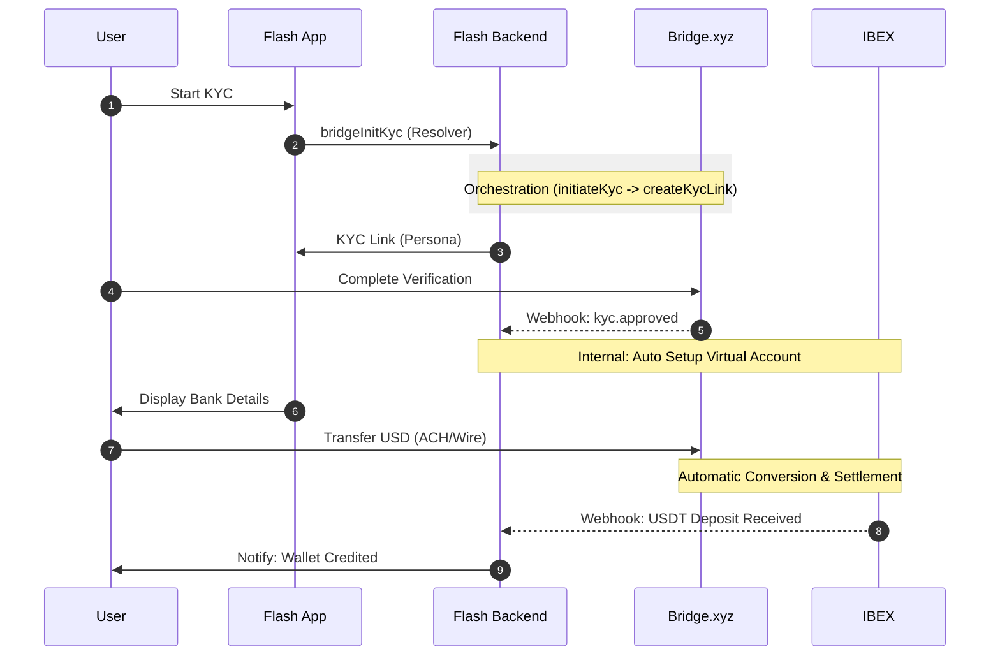

# Bridge.xyz Integration Flows

This document describes the step-by-step flows for USD on-ramp and off-ramp using Bridge.xyz and IBEX.

## On-Ramp Flow (USD -> USDT)

This flow allows users to deposit USD from their bank account and receive USDT in their Flash wallet.

### Sequence Diagram

```ascii
User            Flash App          Flash Backend          Bridge.xyz             IBEX
 |                  |                   |                     |                   |
 | 1. Start KYC     |                   |                     |                   |
 |----------------->| 2. bridgeInitKyc  |                     |                   |
 |                  |------------------>| 3. Create Customer  |                   |
 |                  |                   |-------------------->|                   |
 |                  |                   | 4. Create KYC Link  |                   |
 |                  |                   |-------------------->|                   |
 |                  | 5. KYC Link       |                     |                   |
 |                  |<------------------|                     |                   |
 | 6. Complete KYC  |                   |                     |                   |
 |----------------->|                   |                     |                   |
 | (Persona Flow)   |                   |                     |                   |
 |                  |                   | 7. kyc.approved     |                   |
 |                  |                   |<--------------------|                   |
 |                  |                   | 8. Create Eth Addr  |                   |
 |                  |                   |---------------------------------------->|
 |                  |                   | 9. Create Virt Acc  |                   |
 |                  |                   |-------------------->|                   |
 | 10. View Bank Det|                   |                     |                   |
 |<-----------------|                   |                     |                   |
 | 11. Transfer USD |                   |                     |                   |
 |----------------------------------------------------------->|                   |
 |                  |                   |                     | 12. Convert USD   |
 |                  |                   |                     | 13. Send USDT     |
 |                  |                   |                     |------------------>|
 |                  |                   |                     |                   |
 |                  |                   | 14. Crypto Webhook  |                   |
 |                  |                   |<----------------------------------------|
 |                  | 15. Notify User   |                     |                   |
 |<-----------------|                   |                     |                   |
```

### Steps

1.  **Initiate KYC**: User clicks "Deposit USD" in the app.
2.  **GraphQL Mutation**: App calls [`bridgeInitiateKyc`](https://apidocs.bridge.xyz/api-reference/kyc-links/generate-the-links-needs-to-complete-kyc-for-an-individual-or-business).
3.  **Bridge Customer**: Flash creates a Bridge customer if one doesn't exist.
4.  **KYC Link**: Flash requests a KYC link from Bridge.
5.  **Redirect**: App opens the KYC link (Persona).
6.  **Verification**: User completes identity verification.
7.  [**KYC Webhook**](https://apidocs.bridge.xyz/api-reference/webhooks/create-a-webhook-endpoint): Bridge sends `kyc.approved` webhook to Flash.
8.  [**Ethereum Address**](https://docs.ibexmercado.com/reference/create-receive-info): Flash requests a unique Ethereum USDT receive address from IBEX.
9.  [**Virtual Account**](https://apidocs.bridge.xyz/platform/orchestration/virtual_accounts/virtual-account): Flash creates a Bridge virtual account linked to the Ethereum address.
10. **Display Details**: User sees bank name, routing number, and account number in the app.
11. **Bank Transfer**: User initiates a transfer from their banking app.
12. [**Conversion**](https://apidocs.bridge.xyz/platform/orchestration/virtual_accounts/virtual-account): Bridge receives USD and converts it to USDT.
13. [**Settlement**](https://apidocs.bridge.xyz/platform/orchestration/virtual_accounts/virtual-account): Bridge sends USDT to the user's Ethereum address.
14. [**IBEX Webhook**](https://docs.ibexmercado.com/reference/trigger-transaction-webhook): IBEX detects the incoming USDT and notifies Flash.
15. **Credit**: Flash credits the user's USDT wallet and sends a push notification.


**NOTES** :

1. When the `bridgeInitKyc` is called, we ask for the user's email, full name, and type of kyc (individual or business) and if the user already has a customer id, we check if the latest kyc link is still valid and if not, we create a new one then give the user the kyc link to complete the kyc process. (3. & 4.)

2. The virtual account handles conversion automatically. We don't need a separate conversion step. (12.) When we are creating the virtual account we have to set the destination object with `USDT` as currency and the appropriate `payment_rail` `ethereum` in our case and the `address` field set to the user's IBEX Ethereum address.
Each time a user deposits USD into their virtual account, Bridge will automatically convert it to USDT and send it to the user's IBEX Ethereum address and we will be notified via the webhook we set up in step 14.

### High-Level Integrated On-Ramp Flow

This diagram abstracts many internal operations handled automatically by Bridge and IBEX to show the core user journey, while highlighting the `bridgeInitKyc` orchestration.

> [!NOTE]
> The `bridgeInitKyc` GraphQL resolver calls the `initiateKyc` service function, which triggers the Bridge API `createKycLink` to handle customer and link management.

#### ASCII Version
```ascii
User            Flash App          Flash Backend          Bridge.xyz             IBEX
 |                  |                   |                     |                   |
 | 1. Start KYC     |                   |                     |                   |
 |----------------->| 2. bridgeInitKyc  |                     |                   |
 |                  |    (Resolver)     |                     |                   |
 |                  |        |          |                     |                   |
 |                  |        v          |                     |                   |
 |                  |    initiateKyc    |                     |                   |
 |                  |    (Function)     |                     |                   |
 |                  |        |          |                     |                   |
 |                  |        v          |                     |                   |
 |                  |    createKycLink  |                     |                   |
 |                  |    (Bridge API)   |                     |                   |
 |                  |                   |                     |                   |
 |                  | 3. KYC Link       |                     |                   |
 |                  |<------------------|                     |                   |
 | 4. Complete KYC  |                   |                     |                   |
 |----------------->|                   |                     |                   |
 |                  |                   | 5. kyc.approved     |                   |
 |                  |                   |<--------------------|                   |
 | 6. View Bank Det |                   |                     |                   |
 |<-----------------|                   |                     |                   |
 | 7. Transfer USD  |                   |                     |                   |
 |----------------------------------------------------------->|                   |
 |                  |                   |                     |                   |
 |                  |                   |             (Bridge -> IBEX Automagic)  |
 |                  |                   |                     |                   |
 |                  |                   | 8. Crypto Webhook   |                   |
 |                  |                   |<----------------------------------------|
 |                  | 9. Notify User    |                     |                   |
 |<-----------------|                   |                     |                   |
```

#### Mermaid Version (Recommended for Rendering)


---


## Off-Ramp Flow (USDT -> USD)

This flow allows users to withdraw USDT from their Flash wallet to their external bank account.

### Sequence Diagram

```ascii
User            Flash App          Flash Backend          Bridge.xyz             Bank
 | (Check for KYC, if complete, skip to 12.                   |                   |
 | 1. Start KYC     |                   |                     |                   |
 |----------------->| 2. bridgeInitKyc  |                     |                   |
 |                  |------------------>| 3. Create Customer  |                   |
 |                  |                   |-------------------->|                   |
 |                  |                   | 4. Create KYC Link  |                   |
 |                  |                   |-------------------->|                   |
 |                  | 5. KYC Link       |                     |                   |
 |                  |<------------------|                     |                   |
 | 6. Complete KYC  |                   |                     |                   |
 |----------------->|                   |                     |                   |
 | (Persona Flow)   |                   |                     |                   |
 |                  |                   | 7. kyc.approved     |                   |
 |                  |                   |<--------------------|                   |
 | 8. Link Bank     |                   |                     |                   |
 |----------------->| 9. bridgeAddExtAcc|                     |                   |
 |                  |------------------>| 10. Get Link URL    |                   |
 |                  |                   |-------------------->|                   |
 |                  | 11. Link URL      |                     |                   |
 |                  |<------------------|                     |                   |
 | 12. Auth Bank    |                   |                     |                   |
 |----------------->|                   |                     |                   |
 | (Plaid Flow)     |                   |                     |                   |
 |                  |                   | 13. ext_acc.verified|                   |
 |                  |                   |<--------------------|                   |
 | 14. Withdraw     |                   |                     |                   |
 |----------------->| 15. bridgeInitWith|                     |                   |
 |                  |------------------>| 16. Create Transfer |                   |
 |                  |                   |-------------------->|                   |
 |                  | 17. Pending       |                     |                   |
 |<-----------------|                   |                     |                   |
 |                  |                   |                     | 18. Convert USDT  |
 |                  |                   |                     | 19. Send ACH      |
 |                  |                   |                     |------------------>|
 |                  |                   | 20. trans.completed |                   |
 |                  |                   |<--------------------|                   |
 | 21. Funds Arrive |                   |                     |                   |
 |<-------------------------------------------------------------------------------|
```

### Steps

1.  **Link Bank**: User chooses to add a bank account.
2.  **GraphQL Mutation**: App calls `bridgeAddExternalAccount`.
3.  **Link URL**: Flash requests a hosted link URL from Bridge.
4.  **Redirect**: App opens the Bridge/Plaid flow.
5.  **Authentication**: User logs into their bank and selects an account.
6.  **Verification Webhook**: Bridge notifies Flash when the external account is verified.
7.  **Initiate Withdrawal**: User enters amount and selects the linked bank account.
8.  **GraphQL Mutation**: App calls `bridgeInitiateWithdrawal`.
9.  **Bridge Transfer**: Flash creates a transfer in Bridge from the user's Tron address to the external account.
10. **Confirmation**: App shows the withdrawal as "Pending".
11. **Conversion**: Bridge converts USDT from the user's balance to USD.
12. **ACH Transfer**: Bridge sends USD to the user's bank via ACH.
13. **Transfer Webhook**: Bridge sends `transfer.completed` webhook to Flash.
14. **Completion**: User receives funds in their bank account (usually 1-3 business days).

## Fee Structure

-   **Bridge Fees**: Bridge.xyz charges fees for conversion and transfers (see Bridge.xyz documentation for current rates).
-   **Flash Fee**: Flash charges a **0.5%** service fee on all Bridge transactions, which is included in the total amount shown to the user.
