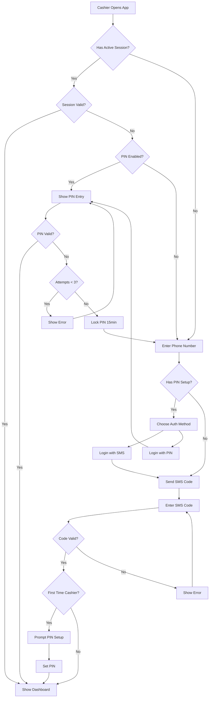
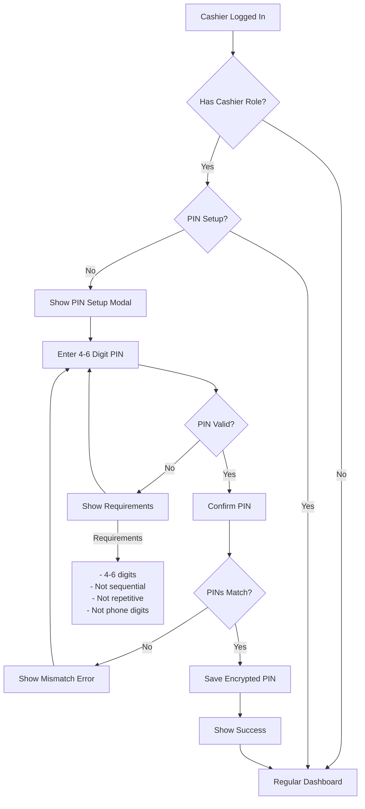
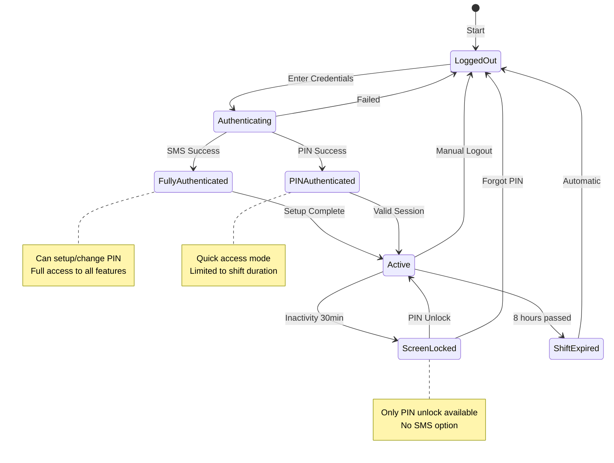
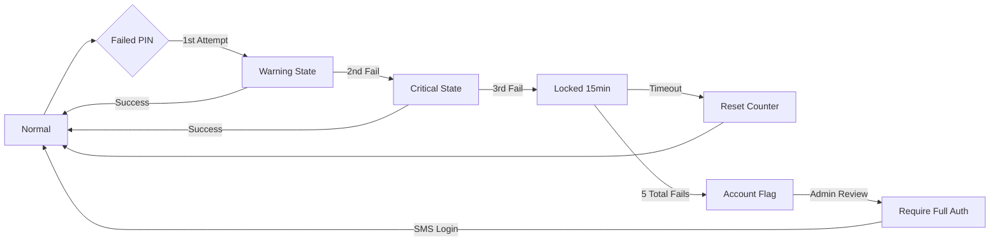
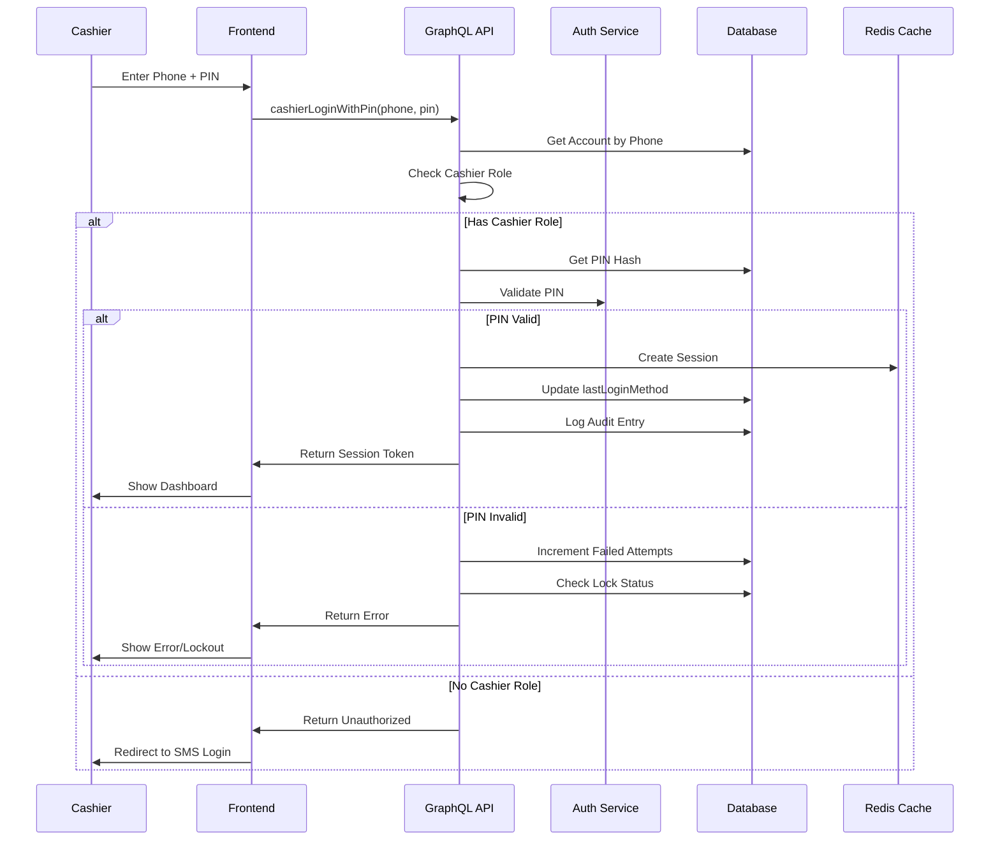
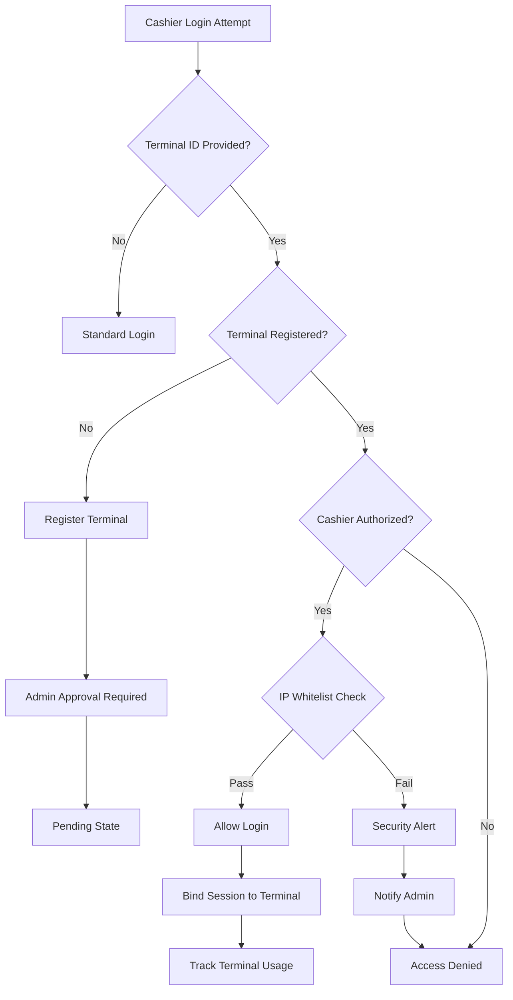
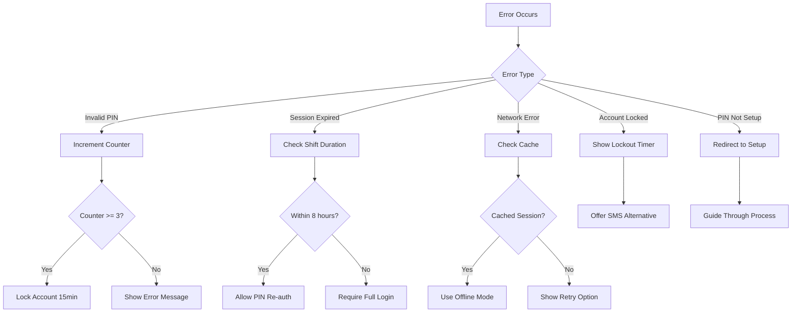
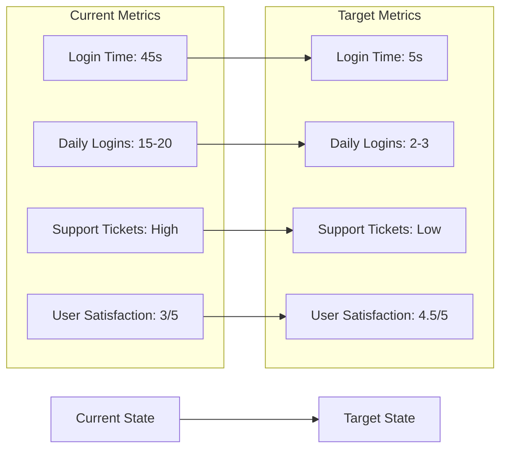

# Cashier Login Flow Diagrams

## Login Decision Flow

## PIN Setup Flow

## Daily Workflow States

## Security State Machine

## Database Interaction Flow

## Terminal Binding Flow (Optional Feature)

## Error Handling Flows

## Implementation Priority Matrix

| Feature | Priority | Complexity | Security Impact |
|---------|----------|------------|-----------------|
| Basic PIN Login | High | Medium | High |
| PIN Setup Flow | High | Low | High |
| Session Management | High | Medium | High |
| Rate Limiting | High | Low | Critical |
| Audit Logging | High | Low | High |
| Screen Lock | Medium | Low | Medium |
| Terminal Binding | Low | High | Medium |
| Biometric Support | Low | High | Low |
| Offline Mode | Low | High | Medium |

## Success Criteria Visualization

